<!-- GENERATED FILE — do not edit. Source: flow.yaml (spec 1). -->
<!-- Regenerate: bash .claude/skills/doctor/scripts/render-flow.sh --write -->

# bootstrap — generated flow view

```mermaid
flowchart TD
  n_bootstrap_entry["bootstrap entry"]
  n_detect_installation_mode["detect installation mode"]
  n_readme_management["readme management"]
  n_detect_project_state{"detect project state"}
  n_path_b_idea_capture["path b idea capture"]
  n_path_b_invoke_discover(("path b invoke discover"))
  n_path_a_entry["path a entry"]
  n_a1_a3_detect_stack["a1 a3 detect stack"]
  n_a2_8_typecheck_readiness["a2 8 typecheck readiness"]
  n_a2_85_tooling_check{"a2 85 tooling check"}
  n_a2_85_quality_tooling(["a2 85 quality tooling 👤"])
  n_a2_9_research_check{"a2 9 research check"}
  n_a2_9_best_practices_research["a2 9 best practices research"]
  n_a3_1_llm_readiness["a3 1 llm readiness"]
  n_a3_2_technical_debt["a3 2 technical debt"]
  n_a3_5_architecture_overview["a3 5 architecture overview"]
  n_a3_55_context_knowledge_base["a3 55 context knowledge base"]
  n_a3_5b_ground_rules(["a3 5b ground rules 👤"])
  n_a3_5c_team_detection["a3 5c team detection"]
  n_a3_7_default_branch["a3 7 default branch"]
  n_a3_8_profile_detection(["a3 8 profile detection 👤"])
  n_a4_generate_configuration["a4 generate configuration"]
  n_a4_2_project_readme{"a4 2 project readme"}
  n_a4_2_generate_readme["a4 2 generate readme"]
  n_a4_2_preserve_readme["a4 2 preserve readme"]
  n_a4_4_update_llms_txt["a4 4 update llms txt"]
  n_a4_5_detect_mcp_servers["a4 5 detect mcp servers"]
  n_a5_run_skill_create["a5 run skill create"]
  n_a5_5_configure_hooks["a5 5 configure hooks"]
  n_a5_6_configure_rules["a5 6 configure rules"]
  n_a5_62_env_template["a5 62 env template"]
  n_a5_65_precommit_assessment{"a5 65 precommit assessment"}
  n_a5_65_lefthook_offer{"a5 65 lefthook offer"}
  n_a5_65_lefthook_available{"a5 65 lefthook available"}
  n_a5_65_install_lefthook["a5 65 install lefthook"]
  n_a5_65_suggest_install["a5 65 suggest install"]
  n_a5_65_configure_other_tool["a5 65 configure other tool"]
  n_a5_65_record_gap["a5 65 record gap"]
  n_a5_7_cicd_assessment{"a5 7 cicd assessment"}
  n_a5_7_cicd_offer{"a5 7 cicd offer"}
  n_a5_7_install_workflow["a5 7 install workflow"]
  n_a5_7_note_other_ci["a5 7 note other ci"]
  n_a5_7_generate_ci_story["a5 7 generate ci story"]
  n_a5_75_document_quality_check["a5 75 document quality check"]
  n_a5_8_readiness_report["a5 8 readiness report"]
  n_a5_9_generate_foundation_backlog["a5 9 generate foundation backlog"]
  n_a5_9_stories_check{"a5 9 stories check"}
  n_a5_9_foundation_approval{"a5 9 foundation approval"}
  n_a5_9_adjust_stories["a5 9 adjust stories"]
  n_a5_9_write_stories["a5 9 write stories"]
  n_a5_9_initialize_backlog_index["a5 9 initialize backlog index"]
  n_a5_95_scaffold_solutions["a5 95 scaffold solutions"]
  n_a6_clean_up["a6 clean up"]
  n_a7_present_summary(("a7 present summary"))
  n_bootstrap_entry --> n_detect_installation_mode
  n_detect_installation_mode --> n_readme_management
  n_readme_management --> n_detect_project_state
  n_detect_project_state -->|source-files-exist| n_path_a_entry
  n_detect_project_state -->|default| n_path_b_idea_capture
  n_path_b_idea_capture --> n_path_b_invoke_discover
  n_path_b_invoke_discover -.->|next skill| nsk_discover
  nsk_discover(["/discover"])
  n_path_a_entry --> n_a1_a3_detect_stack
  n_a1_a3_detect_stack --> n_a2_8_typecheck_readiness
  n_a2_8_typecheck_readiness --> n_a2_85_tooling_check
  n_a2_85_tooling_check -->|all-tools-available| n_a2_9_research_check
  n_a2_85_tooling_check -->|default| n_a2_85_quality_tooling
  n_a2_85_quality_tooling -->|ok| n_a2_9_research_check
  n_a2_9_research_check -->|skip-research| n_a3_1_llm_readiness
  n_a2_9_research_check -->|default| n_a2_9_best_practices_research
  n_a2_9_best_practices_research --> n_a3_1_llm_readiness
  n_a3_1_llm_readiness --> n_a3_2_technical_debt
  n_a3_2_technical_debt --> n_a3_5_architecture_overview
  n_a3_5_architecture_overview --> n_a3_55_context_knowledge_base
  n_a3_55_context_knowledge_base --> n_a3_5b_ground_rules
  n_a3_5b_ground_rules -->|ok| n_a3_5c_team_detection
  n_a3_5c_team_detection --> n_a3_7_default_branch
  n_a3_7_default_branch --> n_a3_8_profile_detection
  n_a3_8_profile_detection -->|ok| n_a4_generate_configuration
  n_a4_generate_configuration --> n_a4_2_project_readme
  n_a4_2_project_readme -->|real-content-readme| n_a4_2_preserve_readme
  n_a4_2_project_readme -->|default| n_a4_2_generate_readme
  n_a4_2_generate_readme --> n_a4_4_update_llms_txt
  n_a4_2_preserve_readme --> n_a4_4_update_llms_txt
  n_a4_4_update_llms_txt --> n_a4_5_detect_mcp_servers
  n_a4_5_detect_mcp_servers --> n_a5_run_skill_create
  n_a5_run_skill_create --> n_a5_5_configure_hooks
  n_a5_5_configure_hooks --> n_a5_6_configure_rules
  n_a5_6_configure_rules --> n_a5_62_env_template
  n_a5_62_env_template --> n_a5_65_precommit_assessment
  n_a5_65_precommit_assessment -->|hooks-found| n_a5_7_cicd_assessment
  n_a5_65_precommit_assessment -->|default| n_a5_65_lefthook_offer
  n_a5_65_lefthook_offer -->|setup-lefthook| n_a5_65_lefthook_available
  n_a5_65_lefthook_offer -->|different-tool| n_a5_65_configure_other_tool
  n_a5_65_lefthook_offer -->|default| n_a5_65_record_gap
  n_a5_65_lefthook_available -->|lefthook-available| n_a5_65_install_lefthook
  n_a5_65_lefthook_available -->|default| n_a5_65_suggest_install
  n_a5_65_install_lefthook --> n_a5_7_cicd_assessment
  n_a5_65_suggest_install --> n_a5_7_cicd_assessment
  n_a5_65_configure_other_tool --> n_a5_7_cicd_assessment
  n_a5_65_record_gap --> n_a5_7_cicd_assessment
  n_a5_7_cicd_assessment -->|cicd-found| n_a5_75_document_quality_check
  n_a5_7_cicd_assessment -->|default| n_a5_7_cicd_offer
  n_a5_7_cicd_offer -->|install-github-actions| n_a5_7_install_workflow
  n_a5_7_cicd_offer -->|different-ci| n_a5_7_note_other_ci
  n_a5_7_cicd_offer -->|default| n_a5_7_generate_ci_story
  n_a5_7_install_workflow --> n_a5_75_document_quality_check
  n_a5_7_note_other_ci --> n_a5_75_document_quality_check
  n_a5_7_generate_ci_story --> n_a5_75_document_quality_check
  n_a5_75_document_quality_check --> n_a5_8_readiness_report
  n_a5_8_readiness_report --> n_a5_9_generate_foundation_backlog
  n_a5_9_generate_foundation_backlog --> n_a5_9_stories_check
  n_a5_9_stories_check -->|no-stories-generated| n_a5_9_initialize_backlog_index
  n_a5_9_stories_check -->|default| n_a5_9_foundation_approval
  n_a5_9_foundation_approval -->|accept-all| n_a5_9_write_stories
  n_a5_9_foundation_approval -->|remove-some| n_a5_9_adjust_stories
  n_a5_9_foundation_approval -->|default| n_a5_9_initialize_backlog_index
  n_a5_9_adjust_stories --> n_a5_9_write_stories
  n_a5_9_write_stories --> n_a5_9_initialize_backlog_index
  n_a5_9_initialize_backlog_index --> n_a5_95_scaffold_solutions
  n_a5_95_scaffold_solutions --> n_a6_clean_up
  n_a6_clean_up --> n_a7_present_summary
  n_a7_present_summary -.->|next skill| nsk_sprint_start
  nsk_sprint_start(["/sprint-start"])
  n_a7_present_summary -.->|next skill| nsk_ideate
  nsk_ideate(["/ideate"])
  n_a7_present_summary -.->|next skill| nsk_optimize
  nsk_optimize(["/optimize"])
```

## Edges

| From | Edge | To |
|------|------|----|
| n_bootstrap_entry | next | n_detect_installation_mode |
| n_detect_installation_mode | next | n_readme_management |
| n_readme_management | next | n_detect_project_state |
| n_detect_project_state | source-files-exist | n_path_a_entry |
| n_detect_project_state | default | n_path_b_idea_capture |
| n_path_b_idea_capture | next | n_path_b_invoke_discover |
| n_path_b_invoke_discover | next skill | nsk_discover |
| n_path_a_entry | next | n_a1_a3_detect_stack |
| n_a1_a3_detect_stack | next | n_a2_8_typecheck_readiness |
| n_a2_8_typecheck_readiness | next | n_a2_85_tooling_check |
| n_a2_85_tooling_check | all-tools-available | n_a2_9_research_check |
| n_a2_85_tooling_check | default | n_a2_85_quality_tooling |
| n_a2_85_quality_tooling | ok | n_a2_9_research_check |
| n_a2_9_research_check | skip-research | n_a3_1_llm_readiness |
| n_a2_9_research_check | default | n_a2_9_best_practices_research |
| n_a2_9_best_practices_research | next | n_a3_1_llm_readiness |
| n_a3_1_llm_readiness | next | n_a3_2_technical_debt |
| n_a3_2_technical_debt | next | n_a3_5_architecture_overview |
| n_a3_5_architecture_overview | next | n_a3_55_context_knowledge_base |
| n_a3_55_context_knowledge_base | next | n_a3_5b_ground_rules |
| n_a3_5b_ground_rules | ok | n_a3_5c_team_detection |
| n_a3_5c_team_detection | next | n_a3_7_default_branch |
| n_a3_7_default_branch | next | n_a3_8_profile_detection |
| n_a3_8_profile_detection | ok | n_a4_generate_configuration |
| n_a4_generate_configuration | next | n_a4_2_project_readme |
| n_a4_2_project_readme | real-content-readme | n_a4_2_preserve_readme |
| n_a4_2_project_readme | default | n_a4_2_generate_readme |
| n_a4_2_generate_readme | next | n_a4_4_update_llms_txt |
| n_a4_2_preserve_readme | next | n_a4_4_update_llms_txt |
| n_a4_4_update_llms_txt | next | n_a4_5_detect_mcp_servers |
| n_a4_5_detect_mcp_servers | next | n_a5_run_skill_create |
| n_a5_run_skill_create | next | n_a5_5_configure_hooks |
| n_a5_5_configure_hooks | next | n_a5_6_configure_rules |
| n_a5_6_configure_rules | next | n_a5_62_env_template |
| n_a5_62_env_template | next | n_a5_65_precommit_assessment |
| n_a5_65_precommit_assessment | hooks-found | n_a5_7_cicd_assessment |
| n_a5_65_precommit_assessment | default | n_a5_65_lefthook_offer |
| n_a5_65_lefthook_offer | setup-lefthook | n_a5_65_lefthook_available |
| n_a5_65_lefthook_offer | different-tool | n_a5_65_configure_other_tool |
| n_a5_65_lefthook_offer | default | n_a5_65_record_gap |
| n_a5_65_lefthook_available | lefthook-available | n_a5_65_install_lefthook |
| n_a5_65_lefthook_available | default | n_a5_65_suggest_install |
| n_a5_65_install_lefthook | next | n_a5_7_cicd_assessment |
| n_a5_65_suggest_install | next | n_a5_7_cicd_assessment |
| n_a5_65_configure_other_tool | next | n_a5_7_cicd_assessment |
| n_a5_65_record_gap | next | n_a5_7_cicd_assessment |
| n_a5_7_cicd_assessment | cicd-found | n_a5_75_document_quality_check |
| n_a5_7_cicd_assessment | default | n_a5_7_cicd_offer |
| n_a5_7_cicd_offer | install-github-actions | n_a5_7_install_workflow |
| n_a5_7_cicd_offer | different-ci | n_a5_7_note_other_ci |
| n_a5_7_cicd_offer | default | n_a5_7_generate_ci_story |
| n_a5_7_install_workflow | next | n_a5_75_document_quality_check |
| n_a5_7_note_other_ci | next | n_a5_75_document_quality_check |
| n_a5_7_generate_ci_story | next | n_a5_75_document_quality_check |
| n_a5_75_document_quality_check | next | n_a5_8_readiness_report |
| n_a5_8_readiness_report | next | n_a5_9_generate_foundation_backlog |
| n_a5_9_generate_foundation_backlog | next | n_a5_9_stories_check |
| n_a5_9_stories_check | no-stories-generated | n_a5_9_initialize_backlog_index |
| n_a5_9_stories_check | default | n_a5_9_foundation_approval |
| n_a5_9_foundation_approval | accept-all | n_a5_9_write_stories |
| n_a5_9_foundation_approval | remove-some | n_a5_9_adjust_stories |
| n_a5_9_foundation_approval | default | n_a5_9_initialize_backlog_index |
| n_a5_9_adjust_stories | next | n_a5_9_write_stories |
| n_a5_9_write_stories | next | n_a5_9_initialize_backlog_index |
| n_a5_9_initialize_backlog_index | next | n_a5_95_scaffold_solutions |
| n_a5_95_scaffold_solutions | next | n_a6_clean_up |
| n_a6_clean_up | next | n_a7_present_summary |
| n_a7_present_summary | next skill | nsk_sprint_start |
| n_a7_present_summary | next skill | nsk_ideate |
| n_a7_present_summary | next skill | nsk_optimize |

Start node: `bootstrap-entry`
