<!-- GENERATED FILE — do not edit. Source: flow.yaml (spec 1). -->
<!-- Regenerate: bash .claude/skills/doctor/scripts/render-flow.sh --write -->

# brainstorm — generated flow view

```mermaid
flowchart TD
  n_brainstorm_entry["brainstorm entry"]
  n_emit_start_event["emit start event"]
  n_p1_explore_problem_space["p1 explore problem space"]
  n_p1_clarify_gate(["p1 clarify gate 👤"])
  n_p2_research_codebase["p2 research codebase"]
  n_p2_5_adr_check{"p2 5 adr check"}
  n_p2_5_scan_adrs["p2 5 scan adrs"]
  n_p2_6_research_offer{"p2 6 research offer"}
  n_p2_6_research_alternatives["p2 6 research alternatives"]
  n_p3_present_approaches["p3 present approaches"]
  n_p3_approach_selection(["p3 approach selection 👤"])
  n_p4_identify_risks["p4 identify risks"]
  n_p4_stride_check{"p4 stride check"}
  n_p4_stride_analysis["p4 stride analysis"]
  n_p5_present_design["p5 present design"]
  n_p5_design_approval(["p5 design approval 👤"])
  n_p6_persist_design["p6 persist design"]
  n_p6_adr_check{"p6 adr check"}
  n_p6_create_adr["p6 create adr"]
  n_p7_next_steps(("p7 next steps"))
  n_brainstorm_entry --> n_emit_start_event
  n_emit_start_event --> n_p1_explore_problem_space
  n_p1_explore_problem_space --> n_p1_clarify_gate
  n_p1_clarify_gate -->|ok| n_p2_research_codebase
  n_p1_clarify_gate -->|idea-vague| n_p1_clarify_gate
  n_p2_research_codebase --> n_p2_5_adr_check
  n_p2_5_adr_check -->|adr-present| n_p2_5_scan_adrs
  n_p2_5_adr_check -->|default| n_p2_6_research_offer
  n_p2_5_scan_adrs --> n_p2_6_research_offer
  n_p2_6_research_offer -->|skip-research| n_p3_present_approaches
  n_p2_6_research_offer -->|default| n_p2_6_research_alternatives
  n_p2_6_research_alternatives --> n_p3_present_approaches
  n_p3_present_approaches --> n_p3_approach_selection
  n_p3_approach_selection -->|ok| n_p4_identify_risks
  n_p4_identify_risks --> n_p4_stride_check
  n_p4_stride_check -->|trust-boundaries| n_p4_stride_analysis
  n_p4_stride_check -->|default| n_p5_present_design
  n_p4_stride_analysis --> n_p5_present_design
  n_p5_present_design --> n_p5_design_approval
  n_p5_design_approval -->|ok| n_p6_persist_design
  stop1(("STOP"))
  n_p5_design_approval -->|fail| stop1
  n_p6_persist_design --> n_p6_adr_check
  n_p6_adr_check -->|architecturally-significant| n_p6_create_adr
  n_p6_adr_check -->|default| n_p7_next_steps
  n_p6_create_adr --> n_p7_next_steps
  n_p7_next_steps -.->|next skill| nsk_ideate
  nsk_ideate(["/ideate"])
```

## Edges

| From | Edge | To |
|------|------|----|
| n_brainstorm_entry | next | n_emit_start_event |
| n_emit_start_event | next | n_p1_explore_problem_space |
| n_p1_explore_problem_space | next | n_p1_clarify_gate |
| n_p1_clarify_gate | ok | n_p2_research_codebase |
| n_p1_clarify_gate | idea-vague | n_p1_clarify_gate |
| n_p2_research_codebase | next | n_p2_5_adr_check |
| n_p2_5_adr_check | adr-present | n_p2_5_scan_adrs |
| n_p2_5_adr_check | default | n_p2_6_research_offer |
| n_p2_5_scan_adrs | next | n_p2_6_research_offer |
| n_p2_6_research_offer | skip-research | n_p3_present_approaches |
| n_p2_6_research_offer | default | n_p2_6_research_alternatives |
| n_p2_6_research_alternatives | next | n_p3_present_approaches |
| n_p3_present_approaches | next | n_p3_approach_selection |
| n_p3_approach_selection | ok | n_p4_identify_risks |
| n_p4_identify_risks | next | n_p4_stride_check |
| n_p4_stride_check | trust-boundaries | n_p4_stride_analysis |
| n_p4_stride_check | default | n_p5_present_design |
| n_p4_stride_analysis | next | n_p5_present_design |
| n_p5_present_design | next | n_p5_design_approval |
| n_p5_design_approval | ok | n_p6_persist_design |
| n_p5_design_approval | fail | stop1 |
| n_p6_persist_design | next | n_p6_adr_check |
| n_p6_adr_check | architecturally-significant | n_p6_create_adr |
| n_p6_adr_check | default | n_p7_next_steps |
| n_p6_create_adr | next | n_p7_next_steps |
| n_p7_next_steps | next skill | nsk_ideate |

Start node: `brainstorm-entry`
