<!-- GENERATED FILE — do not edit. Source: flow.yaml (spec 1). -->
<!-- Regenerate: bash .claude/skills/doctor/scripts/render-flow.sh --write -->

# discover — generated flow view

```mermaid
flowchart TD
  n_discover_entry["discover entry"]
  n_phase_1_classification["phase 1 classification"]
  n_p1a_archetype_selection(["p1a archetype selection 👤"])
  n_p1a_show_archetype_card["p1a show archetype card"]
  n_p1b_subvariant_confirmation(["p1b subvariant confirmation 👤"])
  n_p1c_hybrid_check(["p1c hybrid check 👤"])
  n_p1d_scale_classification(["p1d scale classification 👤"])
  n_p1e_context_baseline["p1e context baseline"]
  n_p1f_mode_selection["p1f mode selection"]
  n_p1f_mode_router{"p1f mode router"}
  n_phase_2_core_identity["phase 2 core identity"]
  n_p2_platform_check{"p2 platform check"}
  n_p2_platform_questions["p2 platform questions"]
  n_rc1_context_research["rc1 context research"]
  n_rc1_research_gate(["rc1 research gate 👤"])
  n_rc1_adjust["rc1 adjust"]
  n_rc1_save_core_identity["rc1 save core identity"]
  n_phase_3_deep_elicitation["phase 3 deep elicitation"]
  n_p3a_archetype_deep_dive["p3a archetype deep dive"]
  n_rc2_feature_research["rc2 feature research"]
  n_rc2_feature_confirm(["rc2 feature confirm 👤"])
  n_p3b_edge_cases["p3b edge cases"]
  n_rc3_ux_patterns(["rc3 ux patterns 👤"])
  n_p3_platform_check{"p3 platform check"}
  n_p3_platform_additional["p3 platform additional"]
  n_p3_save_elicitation["p3 save elicitation"]
  n_p3d_persona_synthesis["p3d persona synthesis"]
  n_p3d_persona_verify(["p3d persona verify 👤"])
  n_p3d_add_persona["p3d add persona"]
  n_p3d_primary_count_check{"p3d primary count check"}
  n_p3d_primary_selection(["p3d primary selection 👤"])
  n_p3d_save_personas["p3d save personas"]
  n_phase_4_entry["phase 4 entry"]
  n_p4a_what_needs_to_be_true["p4a what needs to be true"]
  n_rc4_assumption_validation["rc4 assumption validation"]
  n_p4b_pre_mortem["p4b pre mortem"]
  n_p4c_no_gos["p4c no gos"]
  n_p4c_no_gos_approval(["p4c no gos approval 👤"])
  n_p4_save_register["p4 save register"]
  n_p5_dimension_sweep["p5 dimension sweep"]
  n_rc5_stack_architecture["rc5 stack architecture"]
  n_rc5_constraint_check{"rc5 constraint check"}
  n_rc5_resolve_conflicts["rc5 resolve conflicts"]
  n_p5_ext_dep_check{"p5 ext dep check"}
  n_p5_ext_dep_summary(["p5 ext dep summary 👤"])
  n_p6_vision_synthesis["p6 vision synthesis"]
  n_p6_vision_approval(["p6 vision approval 👤"])
  n_p6_adjust_items["p6 adjust items"]
  n_p7_entry["p7 entry"]
  n_p7a_mvp_feature_selection["p7a mvp feature selection"]
  n_p7a_feature_list_approval(["p7a feature list approval 👤"])
  n_p7b_success_criteria["p7b success criteria"]
  n_p7c_epic_story_generation["p7c epic story generation"]
  n_p7c_story_approval(["p7c story approval 👤"])
  n_p7c_adjust_stories["p7c adjust stories"]
  n_p7c_generate_outputs["p7c generate outputs"]
  n_p7d_mandatory_gate{{"p7d mandatory gate"}}
  n_p7d_personas_check{"p7d personas check"}
  n_p7d_generate_personas["p7d generate personas"]
  n_p7d_populate_docs(("p7d populate docs"))
  n_quick_start_entry["quick start entry"]
  n_quick_essential_questions["quick essential questions"]
  n_quick_research["quick research"]
  n_quick_persona_confirm(["quick persona confirm 👤"])
  n_quick_auto_pick["quick auto pick"]
  n_quick_ext_dep_check{"quick ext dep check"}
  n_quick_ext_dep_notice["quick ext dep notice"]
  n_quick_minimal_backlog["quick minimal backlog"]
  n_quick_start_building(("quick start building"))
  n_pioneering_entry["pioneering entry"]
  n_pioneering_core_identity["pioneering core identity"]
  n_pioneering_proto_personas["pioneering proto personas"]
  n_pioneering_spike_planning["pioneering spike planning"]
  n_pioneering_spike_backlog["pioneering spike backlog"]
  n_pioneering_reenter_discover(("pioneering reenter discover"))
  n_discover_entry --> n_phase_1_classification
  n_phase_1_classification --> n_p1a_archetype_selection
  n_p1a_archetype_selection -->|ok| n_p1b_subvariant_confirmation
  n_p1a_archetype_selection -->|other| n_p1a_show_archetype_card
  n_p1a_show_archetype_card --> n_p1a_archetype_selection
  n_p1b_subvariant_confirmation -->|ok| n_p1c_hybrid_check
  n_p1c_hybrid_check -->|ok| n_p1d_scale_classification
  n_p1c_hybrid_check -->|actually-different| n_p1c_hybrid_check
  n_p1d_scale_classification -->|ok| n_p1e_context_baseline
  n_p1e_context_baseline --> n_p1f_mode_selection
  n_p1f_mode_selection --> n_p1f_mode_router
  n_p1f_mode_router -->|quick| n_quick_start_entry
  n_p1f_mode_router -->|pioneering| n_pioneering_entry
  n_p1f_mode_router -->|default| n_phase_2_core_identity
  n_phase_2_core_identity --> n_p2_platform_check
  n_p2_platform_check -->|platform| n_p2_platform_questions
  n_p2_platform_check -->|default| n_rc1_context_research
  n_p2_platform_questions --> n_rc1_context_research
  n_rc1_context_research --> n_rc1_research_gate
  n_rc1_research_gate -->|ok| n_rc1_save_core_identity
  n_rc1_research_gate -->|adjust| n_rc1_adjust
  n_rc1_research_gate -->|tell-me-more| n_rc1_research_gate
  n_rc1_adjust --> n_rc1_research_gate
  n_rc1_save_core_identity --> n_phase_3_deep_elicitation
  n_phase_3_deep_elicitation --> n_p3a_archetype_deep_dive
  n_p3a_archetype_deep_dive --> n_rc2_feature_research
  n_rc2_feature_research --> n_rc2_feature_confirm
  n_rc2_feature_confirm -->|ok| n_p3b_edge_cases
  n_rc2_feature_confirm -->|fail| n_rc2_feature_research
  n_p3b_edge_cases --> n_rc3_ux_patterns
  n_rc3_ux_patterns -->|ok| n_p3_platform_check
  n_p3_platform_check -->|platform| n_p3_platform_additional
  n_p3_platform_check -->|default| n_p3_save_elicitation
  n_p3_platform_additional --> n_p3_save_elicitation
  n_p3_save_elicitation --> n_p3d_persona_synthesis
  n_p3d_persona_synthesis --> n_p3d_persona_verify
  n_p3d_persona_verify -->|ok| n_p3d_primary_count_check
  n_p3d_persona_verify -->|other-additions| n_p3d_add_persona
  n_p3d_add_persona --> n_p3d_persona_verify
  n_p3d_primary_count_check -->|multiple-confirmed| n_p3d_primary_selection
  n_p3d_primary_count_check -->|default| n_p3d_save_personas
  n_p3d_primary_selection -->|ok| n_p3d_save_personas
  n_p3d_save_personas --> n_phase_4_entry
  n_phase_4_entry --> n_p4a_what_needs_to_be_true
  n_p4a_what_needs_to_be_true --> n_rc4_assumption_validation
  n_rc4_assumption_validation --> n_p4b_pre_mortem
  n_p4b_pre_mortem --> n_p4c_no_gos
  n_p4c_no_gos --> n_p4c_no_gos_approval
  n_p4c_no_gos_approval -->|ok| n_p4_save_register
  n_p4_save_register --> n_p5_dimension_sweep
  n_p5_dimension_sweep --> n_rc5_stack_architecture
  n_rc5_stack_architecture --> n_rc5_constraint_check
  n_rc5_constraint_check -->|conflicts-found| n_rc5_resolve_conflicts
  n_rc5_constraint_check -->|default| n_p5_ext_dep_check
  n_rc5_resolve_conflicts --> n_p5_ext_dep_check
  n_p5_ext_dep_check -->|external-services| n_p5_ext_dep_summary
  n_p5_ext_dep_check -->|default| n_p6_vision_synthesis
  n_p5_ext_dep_summary -->|ok| n_p6_vision_synthesis
  n_p6_vision_synthesis --> n_p6_vision_approval
  n_p6_vision_approval -->|ok| n_p7_entry
  n_p6_vision_approval -->|change-items| n_p6_adjust_items
  stop1(("STOP"))
  n_p6_vision_approval -->|fail| stop1
  n_p6_adjust_items --> n_p6_vision_approval
  n_p7_entry --> n_p7a_mvp_feature_selection
  n_p7a_mvp_feature_selection --> n_p7a_feature_list_approval
  n_p7a_feature_list_approval -->|ok| n_p7b_success_criteria
  n_p7b_success_criteria --> n_p7c_epic_story_generation
  n_p7c_epic_story_generation --> n_p7c_story_approval
  n_p7c_story_approval -->|ok| n_p7c_generate_outputs
  n_p7c_story_approval -->|adjust-stories| n_p7c_adjust_stories
  n_p7c_story_approval -->|fail| n_p7c_epic_story_generation
  n_p7c_adjust_stories --> n_p7c_story_approval
  n_p7c_generate_outputs --> n_p7d_mandatory_gate
  n_p7d_mandatory_gate -->|ok| n_p7d_personas_check
  stop2(("STOP"))
  n_p7d_mandatory_gate -->|fail| stop2
  n_p7d_personas_check -->|personas-missing| n_p7d_generate_personas
  n_p7d_personas_check -->|default| n_p7d_populate_docs
  n_p7d_generate_personas --> n_p7d_populate_docs
  n_quick_start_entry --> n_quick_essential_questions
  n_quick_essential_questions --> n_quick_research
  n_quick_research --> n_quick_persona_confirm
  n_quick_persona_confirm -->|ok| n_quick_auto_pick
  n_quick_auto_pick --> n_quick_ext_dep_check
  n_quick_ext_dep_check -->|external-services| n_quick_ext_dep_notice
  n_quick_ext_dep_check -->|default| n_quick_minimal_backlog
  n_quick_ext_dep_notice --> n_quick_minimal_backlog
  n_quick_minimal_backlog --> n_quick_start_building
  n_pioneering_entry --> n_pioneering_core_identity
  n_pioneering_core_identity --> n_pioneering_proto_personas
  n_pioneering_proto_personas --> n_pioneering_spike_planning
  n_pioneering_spike_planning --> n_pioneering_spike_backlog
  n_pioneering_spike_backlog --> n_pioneering_reenter_discover
  n_pioneering_reenter_discover -.->|next skill| nsk_discover
  nsk_discover(["/discover"])
```

## Edges

| From | Edge | To |
|------|------|----|
| n_discover_entry | next | n_phase_1_classification |
| n_phase_1_classification | next | n_p1a_archetype_selection |
| n_p1a_archetype_selection | ok | n_p1b_subvariant_confirmation |
| n_p1a_archetype_selection | other | n_p1a_show_archetype_card |
| n_p1a_show_archetype_card | next | n_p1a_archetype_selection |
| n_p1b_subvariant_confirmation | ok | n_p1c_hybrid_check |
| n_p1c_hybrid_check | ok | n_p1d_scale_classification |
| n_p1c_hybrid_check | actually-different | n_p1c_hybrid_check |
| n_p1d_scale_classification | ok | n_p1e_context_baseline |
| n_p1e_context_baseline | next | n_p1f_mode_selection |
| n_p1f_mode_selection | next | n_p1f_mode_router |
| n_p1f_mode_router | quick | n_quick_start_entry |
| n_p1f_mode_router | pioneering | n_pioneering_entry |
| n_p1f_mode_router | default | n_phase_2_core_identity |
| n_phase_2_core_identity | next | n_p2_platform_check |
| n_p2_platform_check | platform | n_p2_platform_questions |
| n_p2_platform_check | default | n_rc1_context_research |
| n_p2_platform_questions | next | n_rc1_context_research |
| n_rc1_context_research | next | n_rc1_research_gate |
| n_rc1_research_gate | ok | n_rc1_save_core_identity |
| n_rc1_research_gate | adjust | n_rc1_adjust |
| n_rc1_research_gate | tell-me-more | n_rc1_research_gate |
| n_rc1_adjust | next | n_rc1_research_gate |
| n_rc1_save_core_identity | next | n_phase_3_deep_elicitation |
| n_phase_3_deep_elicitation | next | n_p3a_archetype_deep_dive |
| n_p3a_archetype_deep_dive | next | n_rc2_feature_research |
| n_rc2_feature_research | next | n_rc2_feature_confirm |
| n_rc2_feature_confirm | ok | n_p3b_edge_cases |
| n_rc2_feature_confirm | fail | n_rc2_feature_research |
| n_p3b_edge_cases | next | n_rc3_ux_patterns |
| n_rc3_ux_patterns | ok | n_p3_platform_check |
| n_p3_platform_check | platform | n_p3_platform_additional |
| n_p3_platform_check | default | n_p3_save_elicitation |
| n_p3_platform_additional | next | n_p3_save_elicitation |
| n_p3_save_elicitation | next | n_p3d_persona_synthesis |
| n_p3d_persona_synthesis | next | n_p3d_persona_verify |
| n_p3d_persona_verify | ok | n_p3d_primary_count_check |
| n_p3d_persona_verify | other-additions | n_p3d_add_persona |
| n_p3d_add_persona | next | n_p3d_persona_verify |
| n_p3d_primary_count_check | multiple-confirmed | n_p3d_primary_selection |
| n_p3d_primary_count_check | default | n_p3d_save_personas |
| n_p3d_primary_selection | ok | n_p3d_save_personas |
| n_p3d_save_personas | next | n_phase_4_entry |
| n_phase_4_entry | next | n_p4a_what_needs_to_be_true |
| n_p4a_what_needs_to_be_true | next | n_rc4_assumption_validation |
| n_rc4_assumption_validation | next | n_p4b_pre_mortem |
| n_p4b_pre_mortem | next | n_p4c_no_gos |
| n_p4c_no_gos | next | n_p4c_no_gos_approval |
| n_p4c_no_gos_approval | ok | n_p4_save_register |
| n_p4_save_register | next | n_p5_dimension_sweep |
| n_p5_dimension_sweep | next | n_rc5_stack_architecture |
| n_rc5_stack_architecture | next | n_rc5_constraint_check |
| n_rc5_constraint_check | conflicts-found | n_rc5_resolve_conflicts |
| n_rc5_constraint_check | default | n_p5_ext_dep_check |
| n_rc5_resolve_conflicts | next | n_p5_ext_dep_check |
| n_p5_ext_dep_check | external-services | n_p5_ext_dep_summary |
| n_p5_ext_dep_check | default | n_p6_vision_synthesis |
| n_p5_ext_dep_summary | ok | n_p6_vision_synthesis |
| n_p6_vision_synthesis | next | n_p6_vision_approval |
| n_p6_vision_approval | ok | n_p7_entry |
| n_p6_vision_approval | change-items | n_p6_adjust_items |
| n_p6_vision_approval | fail | stop1 |
| n_p6_adjust_items | next | n_p6_vision_approval |
| n_p7_entry | next | n_p7a_mvp_feature_selection |
| n_p7a_mvp_feature_selection | next | n_p7a_feature_list_approval |
| n_p7a_feature_list_approval | ok | n_p7b_success_criteria |
| n_p7b_success_criteria | next | n_p7c_epic_story_generation |
| n_p7c_epic_story_generation | next | n_p7c_story_approval |
| n_p7c_story_approval | ok | n_p7c_generate_outputs |
| n_p7c_story_approval | adjust-stories | n_p7c_adjust_stories |
| n_p7c_story_approval | fail | n_p7c_epic_story_generation |
| n_p7c_adjust_stories | next | n_p7c_story_approval |
| n_p7c_generate_outputs | next | n_p7d_mandatory_gate |
| n_p7d_mandatory_gate | ok | n_p7d_personas_check |
| n_p7d_mandatory_gate | fail | stop2 |
| n_p7d_personas_check | personas-missing | n_p7d_generate_personas |
| n_p7d_personas_check | default | n_p7d_populate_docs |
| n_p7d_generate_personas | next | n_p7d_populate_docs |
| n_quick_start_entry | next | n_quick_essential_questions |
| n_quick_essential_questions | next | n_quick_research |
| n_quick_research | next | n_quick_persona_confirm |
| n_quick_persona_confirm | ok | n_quick_auto_pick |
| n_quick_auto_pick | next | n_quick_ext_dep_check |
| n_quick_ext_dep_check | external-services | n_quick_ext_dep_notice |
| n_quick_ext_dep_check | default | n_quick_minimal_backlog |
| n_quick_ext_dep_notice | next | n_quick_minimal_backlog |
| n_quick_minimal_backlog | next | n_quick_start_building |
| n_pioneering_entry | next | n_pioneering_core_identity |
| n_pioneering_core_identity | next | n_pioneering_proto_personas |
| n_pioneering_proto_personas | next | n_pioneering_spike_planning |
| n_pioneering_spike_planning | next | n_pioneering_spike_backlog |
| n_pioneering_spike_backlog | next | n_pioneering_reenter_discover |
| n_pioneering_reenter_discover | next skill | nsk_discover |

Start node: `discover-entry`
