<!-- GENERATED FILE — do not edit. Source: flow.yaml (spec 1). -->
<!-- Regenerate: bash .claude/skills/doctor/scripts/render-flow.sh --write -->

# ideate — generated flow view

```mermaid
flowchart TD
  n_emit_start_event["emit start event"]
  n_step_0_discovery_check{"step 0 discovery check"}
  n_step_0_load_discovery_context["step 0 load discovery context"]
  n_step_0_warn_partial_discovery["step 0 warn partial discovery"]
  n_step_0_wait_user_decision(["step 0 wait user decision 👤"])
  n_phase_0_validate_prerequisites{{"phase 0 validate prerequisites"}}
  n_sprint_scope_check{"sprint scope check"}
  n_sprint_scope_notice["sprint scope notice"]
  n_p1_gather_input["p1 gather input"]
  n_p2_research_context["p2 research context"]
  n_p2_5_feasibility_check{"p2 5 feasibility check"}
  n_p2_5_feasibility_research["p2 5 feasibility research"]
  n_p2_5_uncertainty_check{"p2 5 uncertainty check"}
  n_p2_5_add_spike_story["p2 5 add spike story"]
  n_p3_decompose_stories["p3 decompose stories"]
  n_p3_persona_linkage_check{"p3 persona linkage check"}
  n_p3_persona_linkage["p3 persona linkage"]
  n_p4_identify_missing_skills["p4 identify missing skills"]
  n_p4_nfr_check{"p4 nfr check"}
  n_p4_nfr_story_generation["p4 nfr story generation"]
  n_p4_security_ac_check{"p4 security ac check"}
  n_p4_security_ac_generation["p4 security ac generation"]
  n_p4_evil_user_check{"p4 evil user check"}
  n_p4_evil_user_stories["p4 evil user stories"]
  n_p5_external_setup_check{"p5 external setup check"}
  n_p5_generate_setup_from_file["p5 generate setup from file"]
  n_p5_scan_decision_log["p5 scan decision log"]
  n_p5_story_ordering["p5 story ordering"]
  n_p5_e2e_check{"p5 e2e check"}
  n_p5_e2e_strategy["p5 e2e strategy"]
  n_p6_dor_validation["p6 dor validation"]
  n_p6_quality_check_dispatch["p6 quality check dispatch"]
  n_p6_fix_gaps["p6 fix gaps"]
  n_p6_present_output["p6 present output"]
  n_p6_approval_gate(["p6 approval gate 👤"])
  n_p7_write_backlog(("p7 write backlog"))
  n_emit_start_event --> n_step_0_discovery_check
  n_step_0_discovery_check -->|discovery-complete| n_step_0_load_discovery_context
  n_step_0_discovery_check -->|partial-discovery| n_step_0_warn_partial_discovery
  n_step_0_discovery_check -->|default| n_phase_0_validate_prerequisites
  n_step_0_load_discovery_context --> n_phase_0_validate_prerequisites
  n_step_0_warn_partial_discovery --> n_step_0_wait_user_decision
  n_step_0_wait_user_decision -->|ok| n_phase_0_validate_prerequisites
  stop1(("STOP"))
  n_step_0_wait_user_decision -->|fail| stop1
  n_phase_0_validate_prerequisites -->|ok| n_sprint_scope_check
  stop2(("STOP"))
  n_phase_0_validate_prerequisites -->|fail| stop2
  n_sprint_scope_check -->|sprint-active| n_sprint_scope_notice
  n_sprint_scope_check -->|default| n_p1_gather_input
  n_sprint_scope_notice --> n_p1_gather_input
  n_p1_gather_input --> n_p2_research_context
  n_p2_research_context --> n_p2_5_feasibility_check
  n_p2_5_feasibility_check -->|needs-feasibility| n_p2_5_feasibility_research
  n_p2_5_feasibility_check -->|default| n_p3_decompose_stories
  n_p2_5_feasibility_research --> n_p2_5_uncertainty_check
  n_p2_5_uncertainty_check -->|feasibility-uncertain| n_p2_5_add_spike_story
  n_p2_5_uncertainty_check -->|default| n_p3_decompose_stories
  n_p2_5_add_spike_story --> n_p3_decompose_stories
  n_p3_decompose_stories --> n_p3_persona_linkage_check
  n_p3_persona_linkage_check -->|personas-loaded| n_p3_persona_linkage
  n_p3_persona_linkage_check -->|default| n_p4_identify_missing_skills
  n_p3_persona_linkage --> n_p4_identify_missing_skills
  n_p4_identify_missing_skills --> n_p4_nfr_check
  n_p4_nfr_check -->|nfrs-with-thresholds| n_p4_nfr_story_generation
  n_p4_nfr_check -->|default| n_p4_security_ac_check
  n_p4_nfr_story_generation --> n_p4_security_ac_check
  n_p4_security_ac_check -->|security-touching-stories| n_p4_security_ac_generation
  n_p4_security_ac_check -->|default| n_p5_external_setup_check
  n_p4_security_ac_generation --> n_p4_evil_user_check
  n_p4_evil_user_check -->|security-feature-stories| n_p4_evil_user_stories
  n_p4_evil_user_check -->|default| n_p5_external_setup_check
  n_p4_evil_user_stories --> n_p5_external_setup_check
  n_p5_external_setup_check -->|ext-deps-file-exists| n_p5_generate_setup_from_file
  n_p5_external_setup_check -->|default| n_p5_scan_decision_log
  n_p5_generate_setup_from_file --> n_p5_story_ordering
  n_p5_scan_decision_log --> n_p5_story_ordering
  n_p5_story_ordering --> n_p5_e2e_check
  n_p5_e2e_check -->|multiple-stories| n_p5_e2e_strategy
  n_p5_e2e_check -->|default| n_p6_dor_validation
  n_p5_e2e_strategy --> n_p6_dor_validation
  n_p6_dor_validation --> n_p6_quality_check_dispatch
  n_p6_quality_check_dispatch --> n_p6_fix_gaps
  n_p6_fix_gaps --> n_p6_present_output
  n_p6_present_output --> n_p6_approval_gate
  n_p6_approval_gate -->|ok| n_p7_write_backlog
  stop3(("STOP"))
  n_p6_approval_gate -->|fail| stop3
```

## Edges

| From | Edge | To |
|------|------|----|
| n_emit_start_event | next | n_step_0_discovery_check |
| n_step_0_discovery_check | discovery-complete | n_step_0_load_discovery_context |
| n_step_0_discovery_check | partial-discovery | n_step_0_warn_partial_discovery |
| n_step_0_discovery_check | default | n_phase_0_validate_prerequisites |
| n_step_0_load_discovery_context | next | n_phase_0_validate_prerequisites |
| n_step_0_warn_partial_discovery | next | n_step_0_wait_user_decision |
| n_step_0_wait_user_decision | ok | n_phase_0_validate_prerequisites |
| n_step_0_wait_user_decision | fail | stop1 |
| n_phase_0_validate_prerequisites | ok | n_sprint_scope_check |
| n_phase_0_validate_prerequisites | fail | stop2 |
| n_sprint_scope_check | sprint-active | n_sprint_scope_notice |
| n_sprint_scope_check | default | n_p1_gather_input |
| n_sprint_scope_notice | next | n_p1_gather_input |
| n_p1_gather_input | next | n_p2_research_context |
| n_p2_research_context | next | n_p2_5_feasibility_check |
| n_p2_5_feasibility_check | needs-feasibility | n_p2_5_feasibility_research |
| n_p2_5_feasibility_check | default | n_p3_decompose_stories |
| n_p2_5_feasibility_research | next | n_p2_5_uncertainty_check |
| n_p2_5_uncertainty_check | feasibility-uncertain | n_p2_5_add_spike_story |
| n_p2_5_uncertainty_check | default | n_p3_decompose_stories |
| n_p2_5_add_spike_story | next | n_p3_decompose_stories |
| n_p3_decompose_stories | next | n_p3_persona_linkage_check |
| n_p3_persona_linkage_check | personas-loaded | n_p3_persona_linkage |
| n_p3_persona_linkage_check | default | n_p4_identify_missing_skills |
| n_p3_persona_linkage | next | n_p4_identify_missing_skills |
| n_p4_identify_missing_skills | next | n_p4_nfr_check |
| n_p4_nfr_check | nfrs-with-thresholds | n_p4_nfr_story_generation |
| n_p4_nfr_check | default | n_p4_security_ac_check |
| n_p4_nfr_story_generation | next | n_p4_security_ac_check |
| n_p4_security_ac_check | security-touching-stories | n_p4_security_ac_generation |
| n_p4_security_ac_check | default | n_p5_external_setup_check |
| n_p4_security_ac_generation | next | n_p4_evil_user_check |
| n_p4_evil_user_check | security-feature-stories | n_p4_evil_user_stories |
| n_p4_evil_user_check | default | n_p5_external_setup_check |
| n_p4_evil_user_stories | next | n_p5_external_setup_check |
| n_p5_external_setup_check | ext-deps-file-exists | n_p5_generate_setup_from_file |
| n_p5_external_setup_check | default | n_p5_scan_decision_log |
| n_p5_generate_setup_from_file | next | n_p5_story_ordering |
| n_p5_scan_decision_log | next | n_p5_story_ordering |
| n_p5_story_ordering | next | n_p5_e2e_check |
| n_p5_e2e_check | multiple-stories | n_p5_e2e_strategy |
| n_p5_e2e_check | default | n_p6_dor_validation |
| n_p5_e2e_strategy | next | n_p6_dor_validation |
| n_p6_dor_validation | next | n_p6_quality_check_dispatch |
| n_p6_quality_check_dispatch | next | n_p6_fix_gaps |
| n_p6_fix_gaps | next | n_p6_present_output |
| n_p6_present_output | next | n_p6_approval_gate |
| n_p6_approval_gate | ok | n_p7_write_backlog |
| n_p6_approval_gate | fail | stop3 |

Start node: `emit-start-event`
