<!-- GENERATED FILE — do not edit. Source: flow.yaml (spec 1). -->
<!-- Regenerate: bash .claude/skills/doctor/scripts/render-flow.sh --write -->

# live-test — generated flow view

```mermaid
flowchart TD
  n_live_test_entry["live test entry"]
  n_app_map_check{"app map check"}
  n_first_run_interview(["first run interview 👤"])
  n_not_applicable(("not applicable"))
  n_resolve_surface["resolve surface"]
  n_run_preflight["run preflight"]
  n_preflight_gate{{"preflight gate"}}
  n_offer_remediation["offer remediation"]
  n_seed_offer(["seed offer 👤"])
  n_scope_analysis["scope analysis"]
  n_generate_test_plan["generate test plan"]
  n_plan_approval(["plan approval 👤"])
  n_create_findings_file["create findings file"]
  n_toolkit_check{"toolkit check"}
  n_checklist_handoff(("checklist handoff"))
  n_entry_flow_check{{"entry flow check"}}
  n_main_pass["main pass"]
  n_role_sweep["role sweep"]
  n_classify_failures{"classify failures"}
  n_no_fix_check{"no fix check"}
  n_log_finding["log finding"]
  n_fix_investigate["fix investigate"]
  n_write_failing_test["write failing test"]
  n_implement_fix["implement fix"]
  n_run_test_slice{{"run test slice"}}
  n_live_reverify{{"live reverify"}}
  n_fix_attempt_loop[/"fix attempt loop"/]
  n_halt_revert["halt revert"]
  n_commit_fix["commit fix"]
  n_report["report"]
  n_uat_update_check{"uat update check"}
  n_append_uat_rows["append uat rows"]
  n_commit_findings["commit findings"]
  n_run_complete(("run complete"))
  n_live_test_entry --> n_app_map_check
  n_app_map_check -->|missing| n_first_run_interview
  n_app_map_check -->|surface-none| n_not_applicable
  n_app_map_check -->|default| n_resolve_surface
  n_first_run_interview -->|ok| n_resolve_surface
  n_first_run_interview -->|declined| n_not_applicable
  n_not_applicable -.->|next skill| nsk_quality_check
  nsk_quality_check(["/quality-check"])
  n_not_applicable -.->|next skill| nsk_manual_test
  nsk_manual_test(["/manual-test"])
  n_resolve_surface --> n_run_preflight
  n_run_preflight --> n_preflight_gate
  n_preflight_gate -->|ok| n_seed_offer
  n_preflight_gate -->|fail| n_offer_remediation
  n_preflight_gate -->|degraded-accepted| n_seed_offer
  n_offer_remediation --> n_run_preflight
  n_seed_offer -->|ok| n_scope_analysis
  n_scope_analysis --> n_generate_test_plan
  n_generate_test_plan --> n_plan_approval
  n_plan_approval -->|ok| n_create_findings_file
  n_plan_approval -->|trim-extend| n_generate_test_plan
  n_create_findings_file --> n_toolkit_check
  n_toolkit_check -->|toolkit-unavailable| n_checklist_handoff
  n_toolkit_check -->|default| n_entry_flow_check
  n_checklist_handoff -.->|next skill| nsk_manual_test
  nsk_manual_test(["/manual-test"])
  n_entry_flow_check -->|ok| n_main_pass
  stop1(("STOP"))
  n_entry_flow_check -->|fail| stop1
  n_main_pass --> n_role_sweep
  n_role_sweep --> n_classify_failures
  n_classify_failures -->|bug-critical| n_no_fix_check
  n_classify_failures -->|bug-minor| n_log_finding
  n_classify_failures -->|gap| n_log_finding
  n_classify_failures -->|known-issue| n_log_finding
  n_classify_failures -->|enhancement| n_log_finding
  n_classify_failures -->|default| n_report
  n_no_fix_check -->|no-fix-flag| n_log_finding
  n_no_fix_check -->|default| n_fix_investigate
  n_log_finding --> n_classify_failures
  n_fix_investigate --> n_write_failing_test
  n_write_failing_test --> n_implement_fix
  n_implement_fix --> n_run_test_slice
  n_run_test_slice -->|ok| n_live_reverify
  n_run_test_slice -->|fail| n_fix_attempt_loop
  n_run_test_slice -->|breaks-other-tests| n_halt_revert
  n_live_reverify -->|ok| n_commit_fix
  n_live_reverify -->|fail| n_fix_attempt_loop
  n_fix_attempt_loop -->|back| n_fix_investigate
  n_fix_attempt_loop -->|done| n_halt_revert
  n_halt_revert --> n_log_finding
  n_commit_fix --> n_classify_failures
  n_report --> n_uat_update_check
  n_uat_update_check -->|uat-cases-executed| n_append_uat_rows
  n_uat_update_check -->|default| n_commit_findings
  n_append_uat_rows --> n_commit_findings
  n_commit_findings --> n_run_complete
  n_run_complete -.->|next skill| nsk_testing_cycle
  nsk_testing_cycle(["/testing-cycle"])
  n_run_complete -.->|next skill| nsk_ideate
  nsk_ideate(["/ideate"])
```

## Edges

| From | Edge | To |
|------|------|----|
| n_live_test_entry | next | n_app_map_check |
| n_app_map_check | missing | n_first_run_interview |
| n_app_map_check | surface-none | n_not_applicable |
| n_app_map_check | default | n_resolve_surface |
| n_first_run_interview | ok | n_resolve_surface |
| n_first_run_interview | declined | n_not_applicable |
| n_not_applicable | next skill | nsk_quality_check |
| n_not_applicable | next skill | nsk_manual_test |
| n_resolve_surface | next | n_run_preflight |
| n_run_preflight | next | n_preflight_gate |
| n_preflight_gate | ok | n_seed_offer |
| n_preflight_gate | fail | n_offer_remediation |
| n_preflight_gate | degraded-accepted | n_seed_offer |
| n_offer_remediation | next | n_run_preflight |
| n_seed_offer | ok | n_scope_analysis |
| n_scope_analysis | next | n_generate_test_plan |
| n_generate_test_plan | next | n_plan_approval |
| n_plan_approval | ok | n_create_findings_file |
| n_plan_approval | trim-extend | n_generate_test_plan |
| n_create_findings_file | next | n_toolkit_check |
| n_toolkit_check | toolkit-unavailable | n_checklist_handoff |
| n_toolkit_check | default | n_entry_flow_check |
| n_checklist_handoff | next skill | nsk_manual_test |
| n_entry_flow_check | ok | n_main_pass |
| n_entry_flow_check | fail | stop1 |
| n_main_pass | next | n_role_sweep |
| n_role_sweep | next | n_classify_failures |
| n_classify_failures | bug-critical | n_no_fix_check |
| n_classify_failures | bug-minor | n_log_finding |
| n_classify_failures | gap | n_log_finding |
| n_classify_failures | known-issue | n_log_finding |
| n_classify_failures | enhancement | n_log_finding |
| n_classify_failures | default | n_report |
| n_no_fix_check | no-fix-flag | n_log_finding |
| n_no_fix_check | default | n_fix_investigate |
| n_log_finding | next | n_classify_failures |
| n_fix_investigate | next | n_write_failing_test |
| n_write_failing_test | next | n_implement_fix |
| n_implement_fix | next | n_run_test_slice |
| n_run_test_slice | ok | n_live_reverify |
| n_run_test_slice | fail | n_fix_attempt_loop |
| n_run_test_slice | breaks-other-tests | n_halt_revert |
| n_live_reverify | ok | n_commit_fix |
| n_live_reverify | fail | n_fix_attempt_loop |
| n_fix_attempt_loop | back | n_fix_investigate |
| n_fix_attempt_loop | done | n_halt_revert |
| n_halt_revert | next | n_log_finding |
| n_commit_fix | next | n_classify_failures |
| n_report | next | n_uat_update_check |
| n_uat_update_check | uat-cases-executed | n_append_uat_rows |
| n_uat_update_check | default | n_commit_findings |
| n_append_uat_rows | next | n_commit_findings |
| n_commit_findings | next | n_run_complete |
| n_run_complete | next skill | nsk_testing_cycle |
| n_run_complete | next skill | nsk_ideate |

Start node: `live-test-entry`
