<!-- GENERATED FILE — do not edit. Source: flow.yaml (spec 1). -->
<!-- Regenerate: bash .claude/skills/doctor/scripts/render-flow.sh --write -->

# sprint-end — generated flow view

```mermaid
flowchart TD
  n_init["init"]
  n_discover_sprint_state["discover sprint state"]
  n_default_branch_gate{{"default branch gate"}}
  n_no_commits_gate{{"no commits gate"}}
  n_child_streams_gate{{"child streams gate"}}
  n_smoke_test_offer(["smoke test offer 👤"])
  n_gate_selection(["gate selection 👤"])
  n_quality_agent_dispatch["quality agent dispatch"]
  n_quality_hard_gate{{"quality hard gate"}}
  n_fix_quality_issues["fix quality issues"]
  n_uat_coverage_check["uat coverage check"]
  n_documentation_updates["documentation updates"]
  n_prd_review["prd review"]
  n_persona_update["persona update"]
  n_commit_doc_artifacts["commit doc artifacts"]
  n_pr_size_check(["pr size check 👤"])
  n_split_pr["split pr"]
  n_push_create_pr["push create pr"]
  n_ci_configured_router{"ci configured router"}
  n_wait_for_ci{{"wait for ci"}}
  n_fix_ci_failures["fix ci failures"]
  n_review_required_router{"review required router"}
  n_human_review_gate(["human review gate 👤"])
  n_merge_cleanup["merge cleanup"]
  n_sprint_complete(("sprint complete"))
  n_init --> n_discover_sprint_state
  n_discover_sprint_state --> n_default_branch_gate
  n_default_branch_gate -->|ok| n_no_commits_gate
  stop1(("STOP"))
  n_default_branch_gate -->|fail| stop1
  n_no_commits_gate -->|ok| n_child_streams_gate
  stop2(("STOP"))
  n_no_commits_gate -->|fail| stop2
  n_child_streams_gate -->|ok| n_smoke_test_offer
  stop3(("STOP"))
  n_child_streams_gate -->|fail| stop3
  n_smoke_test_offer -->|ok| n_gate_selection
  n_gate_selection -->|ok| n_quality_agent_dispatch
  n_quality_agent_dispatch --> n_quality_hard_gate
  n_quality_hard_gate -->|ok| n_uat_coverage_check
  n_quality_hard_gate -->|fail| n_fix_quality_issues
  n_fix_quality_issues --> n_quality_agent_dispatch
  n_uat_coverage_check --> n_documentation_updates
  n_documentation_updates --> n_prd_review
  n_prd_review --> n_persona_update
  n_persona_update --> n_commit_doc_artifacts
  n_commit_doc_artifacts --> n_pr_size_check
  n_pr_size_check -->|ok| n_push_create_pr
  n_pr_size_check -->|fail| n_split_pr
  n_split_pr --> n_ci_configured_router
  n_push_create_pr --> n_ci_configured_router
  n_ci_configured_router -->|ci-configured| n_wait_for_ci
  n_ci_configured_router -->|default| n_review_required_router
  n_wait_for_ci -->|ok| n_review_required_router
  n_wait_for_ci -->|fail| n_fix_ci_failures
  n_fix_ci_failures --> n_wait_for_ci
  n_review_required_router -->|review-required| n_human_review_gate
  n_review_required_router -->|default| n_merge_cleanup
  n_human_review_gate -->|ok| n_merge_cleanup
  n_human_review_gate -->|fail| n_human_review_gate
  n_merge_cleanup --> n_sprint_complete
  n_sprint_complete -.->|next skill| nsk_retrospective
  nsk_retrospective(["/retrospective"])
  n_sprint_complete -.->|next skill| nsk_sprint_start
  nsk_sprint_start(["/sprint-start"])
  n_sprint_complete -.->|next skill| nsk_handoff
  nsk_handoff(["/handoff"])
```

## Edges

| From | Edge | To |
|------|------|----|
| n_init | next | n_discover_sprint_state |
| n_discover_sprint_state | next | n_default_branch_gate |
| n_default_branch_gate | ok | n_no_commits_gate |
| n_default_branch_gate | fail | stop1 |
| n_no_commits_gate | ok | n_child_streams_gate |
| n_no_commits_gate | fail | stop2 |
| n_child_streams_gate | ok | n_smoke_test_offer |
| n_child_streams_gate | fail | stop3 |
| n_smoke_test_offer | ok | n_gate_selection |
| n_gate_selection | ok | n_quality_agent_dispatch |
| n_quality_agent_dispatch | next | n_quality_hard_gate |
| n_quality_hard_gate | ok | n_uat_coverage_check |
| n_quality_hard_gate | fail | n_fix_quality_issues |
| n_fix_quality_issues | next | n_quality_agent_dispatch |
| n_uat_coverage_check | next | n_documentation_updates |
| n_documentation_updates | next | n_prd_review |
| n_prd_review | next | n_persona_update |
| n_persona_update | next | n_commit_doc_artifacts |
| n_commit_doc_artifacts | next | n_pr_size_check |
| n_pr_size_check | ok | n_push_create_pr |
| n_pr_size_check | fail | n_split_pr |
| n_split_pr | next | n_ci_configured_router |
| n_push_create_pr | next | n_ci_configured_router |
| n_ci_configured_router | ci-configured | n_wait_for_ci |
| n_ci_configured_router | default | n_review_required_router |
| n_wait_for_ci | ok | n_review_required_router |
| n_wait_for_ci | fail | n_fix_ci_failures |
| n_fix_ci_failures | next | n_wait_for_ci |
| n_review_required_router | review-required | n_human_review_gate |
| n_review_required_router | default | n_merge_cleanup |
| n_human_review_gate | ok | n_merge_cleanup |
| n_human_review_gate | fail | n_human_review_gate |
| n_merge_cleanup | next | n_sprint_complete |
| n_sprint_complete | next skill | nsk_retrospective |
| n_sprint_complete | next skill | nsk_sprint_start |
| n_sprint_complete | next skill | nsk_handoff |

Start node: `init`
