<!-- GENERATED FILE — do not edit. Source: flow.yaml (spec 1). -->
<!-- Regenerate: bash .claude/skills/doctor/scripts/render-flow.sh --write -->

# sprint-start — generated flow view

```mermaid
flowchart TD
  n_emit_start_event["emit start event"]
  n_read_profile["read profile"]
  n_check_open_prs["check open prs"]
  n_open_pr_router{"open pr router"}
  n_merge_approved_prs["merge approved prs"]
  n_remaining_awaiting_router{"remaining awaiting router"}
  n_awaiting_review_gate(["awaiting review gate 👤"])
  n_verify_clean_tree{{"verify clean tree"}}
  n_sync_default_branch["sync default branch"]
  n_verify_tests_pass{{"verify tests pass"}}
  n_metrics_health_check["metrics health check"]
  n_debt_check_router{"debt check router"}
  n_debt_health_check["debt health check"]
  n_determine_sprint_number["determine sprint number"]
  n_branch_mode_router{"branch mode router"}
  n_create_branch["create branch"]
  n_create_worktree["create worktree"]
  n_draft_pr_router{"draft pr router"}
  n_draft_pr_offer(["draft pr offer 👤"])
  n_create_draft_pr["create draft pr"]
  n_show_upcoming_stories["show upcoming stories"]
  n_ready_stories_router{"ready stories router"}
  n_no_ready_stories_gate(["no ready stories gate 👤"])
  n_define_sprint_goal(["define sprint goal 👤"])
  n_prd_summary_router{"prd summary router"}
  n_derive_sprint_dod["derive sprint dod"]
  n_create_sprint_spec["create sprint spec"]
  n_update_progress["update progress"]
  n_done(("done"))
  n_emit_start_event --> n_read_profile
  n_read_profile --> n_check_open_prs
  n_check_open_prs --> n_open_pr_router
  n_open_pr_router -->|approved| n_merge_approved_prs
  n_open_pr_router -->|awaiting-review| n_awaiting_review_gate
  n_open_pr_router -->|default| n_verify_clean_tree
  n_merge_approved_prs --> n_remaining_awaiting_router
  n_remaining_awaiting_router -->|awaiting-review| n_awaiting_review_gate
  n_remaining_awaiting_router -->|default| n_verify_clean_tree
  n_awaiting_review_gate -->|ok| n_verify_clean_tree
  stop1(("STOP"))
  n_awaiting_review_gate -->|fail| stop1
  n_verify_clean_tree -->|ok| n_sync_default_branch
  stop2(("STOP"))
  n_verify_clean_tree -->|fail| stop2
  n_sync_default_branch --> n_verify_tests_pass
  n_verify_tests_pass -->|ok| n_metrics_health_check
  stop3(("STOP"))
  n_verify_tests_pass -->|fail| stop3
  n_metrics_health_check --> n_debt_check_router
  n_debt_check_router -->|debt-active| n_debt_health_check
  n_debt_check_router -->|default| n_determine_sprint_number
  n_debt_health_check --> n_determine_sprint_number
  n_determine_sprint_number --> n_branch_mode_router
  n_branch_mode_router -->|worktree| n_create_worktree
  n_branch_mode_router -->|default| n_create_branch
  n_create_branch --> n_draft_pr_router
  n_create_worktree --> n_draft_pr_router
  n_draft_pr_router -->|ci-available| n_draft_pr_offer
  n_draft_pr_router -->|default| n_show_upcoming_stories
  n_draft_pr_offer -->|ok| n_create_draft_pr
  n_draft_pr_offer -->|fail| n_show_upcoming_stories
  n_create_draft_pr --> n_show_upcoming_stories
  n_show_upcoming_stories --> n_ready_stories_router
  n_ready_stories_router -->|no-ready-stories| n_no_ready_stories_gate
  n_ready_stories_router -->|default| n_define_sprint_goal
  n_no_ready_stories_gate -->|ok| n_define_sprint_goal
  stop4(("STOP"))
  n_no_ready_stories_gate -->|fail| stop4
  n_define_sprint_goal -->|ok| n_prd_summary_router
  n_prd_summary_router -->|prd-exists| n_derive_sprint_dod
  n_prd_summary_router -->|default| n_create_sprint_spec
  n_derive_sprint_dod --> n_create_sprint_spec
  n_create_sprint_spec --> n_update_progress
  n_update_progress --> n_done
  n_done -.->|next skill| nsk_story_cycle
  nsk_story_cycle(["/story-cycle"])
```

## Edges

| From | Edge | To |
|------|------|----|
| n_emit_start_event | next | n_read_profile |
| n_read_profile | next | n_check_open_prs |
| n_check_open_prs | next | n_open_pr_router |
| n_open_pr_router | approved | n_merge_approved_prs |
| n_open_pr_router | awaiting-review | n_awaiting_review_gate |
| n_open_pr_router | default | n_verify_clean_tree |
| n_merge_approved_prs | next | n_remaining_awaiting_router |
| n_remaining_awaiting_router | awaiting-review | n_awaiting_review_gate |
| n_remaining_awaiting_router | default | n_verify_clean_tree |
| n_awaiting_review_gate | ok | n_verify_clean_tree |
| n_awaiting_review_gate | fail | stop1 |
| n_verify_clean_tree | ok | n_sync_default_branch |
| n_verify_clean_tree | fail | stop2 |
| n_sync_default_branch | next | n_verify_tests_pass |
| n_verify_tests_pass | ok | n_metrics_health_check |
| n_verify_tests_pass | fail | stop3 |
| n_metrics_health_check | next | n_debt_check_router |
| n_debt_check_router | debt-active | n_debt_health_check |
| n_debt_check_router | default | n_determine_sprint_number |
| n_debt_health_check | next | n_determine_sprint_number |
| n_determine_sprint_number | next | n_branch_mode_router |
| n_branch_mode_router | worktree | n_create_worktree |
| n_branch_mode_router | default | n_create_branch |
| n_create_branch | next | n_draft_pr_router |
| n_create_worktree | next | n_draft_pr_router |
| n_draft_pr_router | ci-available | n_draft_pr_offer |
| n_draft_pr_router | default | n_show_upcoming_stories |
| n_draft_pr_offer | ok | n_create_draft_pr |
| n_draft_pr_offer | fail | n_show_upcoming_stories |
| n_create_draft_pr | next | n_show_upcoming_stories |
| n_show_upcoming_stories | next | n_ready_stories_router |
| n_ready_stories_router | no-ready-stories | n_no_ready_stories_gate |
| n_ready_stories_router | default | n_define_sprint_goal |
| n_no_ready_stories_gate | ok | n_define_sprint_goal |
| n_no_ready_stories_gate | fail | stop4 |
| n_define_sprint_goal | ok | n_prd_summary_router |
| n_prd_summary_router | prd-exists | n_derive_sprint_dod |
| n_prd_summary_router | default | n_create_sprint_spec |
| n_derive_sprint_dod | next | n_create_sprint_spec |
| n_create_sprint_spec | next | n_update_progress |
| n_update_progress | next | n_done |
| n_done | next skill | nsk_story_cycle |

Start node: `emit-start-event`
