<!-- GENERATED FILE — do not edit. Source: flow.yaml (spec 1). -->
<!-- Regenerate: bash .claude/skills/doctor/scripts/render-flow.sh --write -->

# story-cycle — generated flow view

```mermaid
flowchart TD
  n_emit_start_event["emit start event"]
  n_create_task_list["create task list"]
  n_read_profile["read profile"]
  n_context_prime["context prime"]
  n_backlog_story_lookup["backlog story lookup"]
  n_sprint_context_load["sprint context load"]
  n_prd_scope_guard["prd scope guard"]
  n_discovery_context_load["discovery context load"]
  n_scope_analysis(["scope analysis 👤"])
  n_classify_size_risk["classify size risk"]
  n_fast_track_red_flag{{"fast track red flag"}}
  n_size_router{"size router"}
  n_phase_1_preflight["phase 1 preflight"]
  n_identify_story_type["identify story type"]
  n_codebase_exploration["codebase exploration"]
  n_research_codebase["research codebase"]
  n_research_requirement_router{"research requirement router"}
  n_execute_research["execute research"]
  n_print_research_decision{{"print research decision"}}
  n_dependency_freshness_check["dependency freshness check"]
  n_define_required_skills["define required skills"]
  n_discovery_gate{"discovery gate"}
  n_clarify_unknowns(["clarify unknowns 👤"])
  n_story_refinement["story refinement"]
  n_write_plan["write plan"]
  n_marker_cap_gate(["marker cap gate 👤"])
  n_ground_rules_check{{"ground rules check"}}
  n_clarification_check(["clarification check 👤"])
  n_plan_completeness{{"plan completeness"}}
  n_depth_check(["depth check 👤"])
  n_deep_dive["deep dive"]
  n_plan_approval(["plan approval 👤"])
  n_context_pruning["context pruning"]
  n_readiness_gate{{"readiness gate"}}
  n_address_readiness_gap["address readiness gap"]
  n_phase_3a_check{"phase 3a check"}
  n_stream_analysis{"stream analysis"}
  n_stream_approval(["stream approval 👤"])
  n_stream_checkpoint["stream checkpoint"]
  n_phase_3_entry["phase 3 entry"]
  n_stream_fanout[["stream fanout"]]
  n_stream_agent_a["stream agent a"]
  n_stream_agent_b["stream agent b"]
  n_stream_merge_join[["stream merge join"]]
  n_merge_fallback_check{"merge fallback check"}
  n_execute_story_type["execute story type"]
  n_tdd_ordering_gate{{"tdd ordering gate"}}
  n_write_test_first["write test first"]
  n_implement_code["implement code"]
  n_phase_3_error_check{"phase 3 error check"}
  n_web_error_recovery["web error recovery"]
  n_self_review["self review"]
  n_self_review_gate{{"self review gate"}}
  n_quality_dispatch["quality dispatch"]
  n_quality_gates{{"quality gates"}}
  n_fix_gate_failure["fix gate failure"]
  n_uat_check{"uat check"}
  n_generate_uat["generate uat"]
  n_sense_check_uat["sense check uat"]
  n_verify_ac_evidence{{"verify ac evidence"}}
  n_ac_gap_loop[/"ac gap loop"/]
  n_verification_halt{"verification halt"}
  n_checkpoint_rollback["checkpoint rollback"]
  n_save_failure_state(("save failure state"))
  n_docs_and_commit["docs and commit"]
  n_invoke_commit["invoke commit"]
  n_emit_end_event["emit end event"]
  n_completion_report(("completion report"))
  n_phase_3_lite_entry["phase 3 lite entry"]
  n_phase_3_lite_commit["phase 3 lite commit"]
  n_emit_start_event --> n_create_task_list
  n_create_task_list --> n_read_profile
  n_read_profile --> n_context_prime
  n_context_prime --> n_backlog_story_lookup
  n_backlog_story_lookup --> n_sprint_context_load
  n_sprint_context_load --> n_prd_scope_guard
  n_prd_scope_guard --> n_discovery_context_load
  n_discovery_context_load --> n_scope_analysis
  n_scope_analysis -->|ok| n_classify_size_risk
  n_classify_size_risk --> n_fast_track_red_flag
  n_fast_track_red_flag -->|ok| n_size_router
  n_fast_track_red_flag -->|fail| n_phase_1_preflight
  n_size_router -->|trivial| n_phase_3_lite_entry
  n_size_router -->|small| n_phase_1_preflight
  n_size_router -->|default| n_phase_1_preflight
  n_phase_1_preflight --> n_identify_story_type
  n_identify_story_type --> n_codebase_exploration
  n_codebase_exploration --> n_research_codebase
  n_research_codebase --> n_research_requirement_router
  n_research_requirement_router -->|research-needed| n_execute_research
  n_research_requirement_router -->|default| n_print_research_decision
  n_execute_research --> n_print_research_decision
  n_print_research_decision -->|ok| n_dependency_freshness_check
  stop1(("STOP"))
  n_print_research_decision -->|fail| stop1
  n_dependency_freshness_check --> n_define_required_skills
  n_define_required_skills --> n_discovery_gate
  n_discovery_gate -->|sufficient-info| n_story_refinement
  n_discovery_gate -->|default| n_clarify_unknowns
  n_clarify_unknowns -->|ok| n_story_refinement
  n_story_refinement --> n_write_plan
  n_write_plan --> n_marker_cap_gate
  n_marker_cap_gate -->|ok| n_ground_rules_check
  n_ground_rules_check -->|ok| n_clarification_check
  stop2(("STOP"))
  n_ground_rules_check -->|fail| stop2
  n_clarification_check -->|ok| n_plan_completeness
  n_plan_completeness -->|ok| n_depth_check
  n_plan_completeness -->|fail| n_research_requirement_router
  n_depth_check -->|ok| n_plan_approval
  n_depth_check -->|fail| n_deep_dive
  n_deep_dive --> n_plan_approval
  n_plan_approval -->|ok| n_context_pruning
  n_context_pruning --> n_readiness_gate
  n_readiness_gate -->|ok| n_phase_3a_check
  n_readiness_gate -->|fail| n_address_readiness_gap
  n_readiness_gate -->|user-override| n_phase_3a_check
  n_address_readiness_gap --> n_readiness_gate
  n_phase_3a_check -->|parallel-eligible| n_stream_analysis
  n_phase_3a_check -->|default| n_phase_3_entry
  n_stream_analysis -->|streams-independent| n_stream_approval
  n_stream_analysis -->|default| n_phase_3_entry
  n_stream_approval -->|ok| n_stream_checkpoint
  n_stream_approval -->|fail| n_phase_3_entry
  n_stream_checkpoint --> n_stream_fanout
  n_phase_3_entry --> n_execute_story_type
  n_stream_fanout --> n_stream_agent_a
  n_stream_fanout --> n_stream_agent_b
  n_stream_agent_a --> n_stream_merge_join
  n_stream_agent_b --> n_stream_merge_join
  n_stream_merge_join --> n_merge_fallback_check
  n_merge_fallback_check -->|merge-failed| n_phase_3_entry
  n_merge_fallback_check -->|default| n_self_review
  n_execute_story_type --> n_tdd_ordering_gate
  n_tdd_ordering_gate -->|ok| n_implement_code
  n_tdd_ordering_gate -->|fail| n_write_test_first
  n_write_test_first --> n_tdd_ordering_gate
  n_implement_code --> n_phase_3_error_check
  n_phase_3_error_check -->|external-library-error| n_web_error_recovery
  n_phase_3_error_check -->|internal-error| n_implement_code
  n_phase_3_error_check -->|default| n_self_review
  n_web_error_recovery --> n_implement_code
  n_self_review --> n_self_review_gate
  n_self_review_gate -->|ok| n_quality_dispatch
  n_self_review_gate -->|fail| n_implement_code
  n_quality_dispatch --> n_quality_gates
  n_quality_gates -->|ok| n_uat_check
  n_quality_gates -->|fail| n_fix_gate_failure
  n_fix_gate_failure --> n_quality_gates
  n_uat_check -->|uat-applies| n_generate_uat
  n_uat_check -->|default| n_verify_ac_evidence
  n_generate_uat --> n_sense_check_uat
  n_sense_check_uat --> n_verify_ac_evidence
  n_verify_ac_evidence -->|ok| n_docs_and_commit
  n_verify_ac_evidence -->|fail| n_ac_gap_loop
  n_ac_gap_loop -->|back| n_implement_code
  n_ac_gap_loop -->|done| n_verification_halt
  n_verification_halt -->|rollback| n_checkpoint_rollback
  n_verification_halt -->|continue| n_save_failure_state
  n_verification_halt -->|force| n_docs_and_commit
  stop3(("STOP"))
  n_verification_halt -->|default| stop3
  stop4(("STOP"))
  n_checkpoint_rollback --> stop4
  n_save_failure_state -.->|next skill| nsk_continue
  nsk_continue(["/continue"])
  n_docs_and_commit --> n_invoke_commit
  n_invoke_commit --> n_emit_end_event
  n_emit_end_event --> n_completion_report
  n_completion_report -.->|next skill| nsk_story_cycle
  nsk_story_cycle(["/story-cycle"])
  n_completion_report -.->|next skill| nsk_sprint_end
  nsk_sprint_end(["/sprint-end"])
  n_completion_report -.->|next skill| nsk_handoff
  nsk_handoff(["/handoff"])
  n_phase_3_lite_entry --> n_phase_3_lite_commit
  n_phase_3_lite_commit --> n_completion_report
```

## Edges

| From | Edge | To |
|------|------|----|
| n_emit_start_event | next | n_create_task_list |
| n_create_task_list | next | n_read_profile |
| n_read_profile | next | n_context_prime |
| n_context_prime | next | n_backlog_story_lookup |
| n_backlog_story_lookup | next | n_sprint_context_load |
| n_sprint_context_load | next | n_prd_scope_guard |
| n_prd_scope_guard | next | n_discovery_context_load |
| n_discovery_context_load | next | n_scope_analysis |
| n_scope_analysis | ok | n_classify_size_risk |
| n_classify_size_risk | next | n_fast_track_red_flag |
| n_fast_track_red_flag | ok | n_size_router |
| n_fast_track_red_flag | fail | n_phase_1_preflight |
| n_size_router | trivial | n_phase_3_lite_entry |
| n_size_router | small | n_phase_1_preflight |
| n_size_router | default | n_phase_1_preflight |
| n_phase_1_preflight | next | n_identify_story_type |
| n_identify_story_type | next | n_codebase_exploration |
| n_codebase_exploration | next | n_research_codebase |
| n_research_codebase | next | n_research_requirement_router |
| n_research_requirement_router | research-needed | n_execute_research |
| n_research_requirement_router | default | n_print_research_decision |
| n_execute_research | next | n_print_research_decision |
| n_print_research_decision | ok | n_dependency_freshness_check |
| n_print_research_decision | fail | stop1 |
| n_dependency_freshness_check | next | n_define_required_skills |
| n_define_required_skills | next | n_discovery_gate |
| n_discovery_gate | sufficient-info | n_story_refinement |
| n_discovery_gate | default | n_clarify_unknowns |
| n_clarify_unknowns | ok | n_story_refinement |
| n_story_refinement | next | n_write_plan |
| n_write_plan | next | n_marker_cap_gate |
| n_marker_cap_gate | ok | n_ground_rules_check |
| n_ground_rules_check | ok | n_clarification_check |
| n_ground_rules_check | fail | stop2 |
| n_clarification_check | ok | n_plan_completeness |
| n_plan_completeness | ok | n_depth_check |
| n_plan_completeness | fail | n_research_requirement_router |
| n_depth_check | ok | n_plan_approval |
| n_depth_check | fail | n_deep_dive |
| n_deep_dive | next | n_plan_approval |
| n_plan_approval | ok | n_context_pruning |
| n_context_pruning | next | n_readiness_gate |
| n_readiness_gate | ok | n_phase_3a_check |
| n_readiness_gate | fail | n_address_readiness_gap |
| n_readiness_gate | user-override | n_phase_3a_check |
| n_address_readiness_gap | next | n_readiness_gate |
| n_phase_3a_check | parallel-eligible | n_stream_analysis |
| n_phase_3a_check | default | n_phase_3_entry |
| n_stream_analysis | streams-independent | n_stream_approval |
| n_stream_analysis | default | n_phase_3_entry |
| n_stream_approval | ok | n_stream_checkpoint |
| n_stream_approval | fail | n_phase_3_entry |
| n_stream_checkpoint | next | n_stream_fanout |
| n_phase_3_entry | next | n_execute_story_type |
| n_stream_fanout | next | n_stream_agent_a |
| n_stream_fanout | next | n_stream_agent_b |
| n_stream_agent_a | next | n_stream_merge_join |
| n_stream_agent_b | next | n_stream_merge_join |
| n_stream_merge_join | next | n_merge_fallback_check |
| n_merge_fallback_check | merge-failed | n_phase_3_entry |
| n_merge_fallback_check | default | n_self_review |
| n_execute_story_type | next | n_tdd_ordering_gate |
| n_tdd_ordering_gate | ok | n_implement_code |
| n_tdd_ordering_gate | fail | n_write_test_first |
| n_write_test_first | next | n_tdd_ordering_gate |
| n_implement_code | next | n_phase_3_error_check |
| n_phase_3_error_check | external-library-error | n_web_error_recovery |
| n_phase_3_error_check | internal-error | n_implement_code |
| n_phase_3_error_check | default | n_self_review |
| n_web_error_recovery | next | n_implement_code |
| n_self_review | next | n_self_review_gate |
| n_self_review_gate | ok | n_quality_dispatch |
| n_self_review_gate | fail | n_implement_code |
| n_quality_dispatch | next | n_quality_gates |
| n_quality_gates | ok | n_uat_check |
| n_quality_gates | fail | n_fix_gate_failure |
| n_fix_gate_failure | next | n_quality_gates |
| n_uat_check | uat-applies | n_generate_uat |
| n_uat_check | default | n_verify_ac_evidence |
| n_generate_uat | next | n_sense_check_uat |
| n_sense_check_uat | next | n_verify_ac_evidence |
| n_verify_ac_evidence | ok | n_docs_and_commit |
| n_verify_ac_evidence | fail | n_ac_gap_loop |
| n_ac_gap_loop | back | n_implement_code |
| n_ac_gap_loop | done | n_verification_halt |
| n_verification_halt | rollback | n_checkpoint_rollback |
| n_verification_halt | continue | n_save_failure_state |
| n_verification_halt | force | n_docs_and_commit |
| n_verification_halt | default | stop3 |
| n_checkpoint_rollback | next | stop4 |
| n_save_failure_state | next skill | nsk_continue |
| n_docs_and_commit | next | n_invoke_commit |
| n_invoke_commit | next | n_emit_end_event |
| n_emit_end_event | next | n_completion_report |
| n_completion_report | next skill | nsk_story_cycle |
| n_completion_report | next skill | nsk_sprint_end |
| n_completion_report | next skill | nsk_handoff |
| n_phase_3_lite_entry | next | n_phase_3_lite_commit |
| n_phase_3_lite_commit | next | n_completion_report |

Start node: `emit-start-event`
