<!-- GENERATED FILE — do not edit. Source: flow.yaml (spec 1). -->
<!-- Regenerate: bash .claude/skills/doctor/scripts/render-flow.sh --write -->

# story-cycle — generated flow view

```mermaid
flowchart TD
  emit_start_event["emit start event"]
  create_task_list["create task list"]
  read_profile["read profile"]
  context_prime["context prime"]
  backlog_story_lookup["backlog story lookup"]
  sprint_context_load["sprint context load"]
  prd_scope_guard["prd scope guard"]
  discovery_context_load["discovery context load"]
  scope_analysis(["scope analysis 👤"])
  classify_size_risk["classify size risk"]
  fast_track_red_flag{{"fast track red flag"}}
  size_router{"size router"}
  phase_1_preflight["phase 1 preflight"]
  identify_story_type["identify story type"]
  codebase_exploration["codebase exploration"]
  research_codebase["research codebase"]
  research_requirement_router{"research requirement router"}
  execute_research["execute research"]
  print_research_decision{{"print research decision"}}
  dependency_freshness_check["dependency freshness check"]
  define_required_skills["define required skills"]
  discovery_gate{"discovery gate"}
  clarify_unknowns(["clarify unknowns 👤"])
  story_refinement["story refinement"]
  write_plan["write plan"]
  marker_cap_gate(["marker cap gate 👤"])
  ground_rules_check{{"ground rules check"}}
  clarification_check(["clarification check 👤"])
  plan_completeness{{"plan completeness"}}
  depth_check(["depth check 👤"])
  deep_dive["deep dive"]
  plan_approval(["plan approval 👤"])
  context_pruning["context pruning"]
  readiness_gate{{"readiness gate"}}
  address_readiness_gap["address readiness gap"]
  phase_3a_check{"phase 3a check"}
  stream_analysis{"stream analysis"}
  stream_approval(["stream approval 👤"])
  phase_3_entry["phase 3 entry"]
  stream_fanout[["stream fanout"]]
  stream_agent_a["stream agent a"]
  stream_agent_b["stream agent b"]
  stream_merge_join[["stream merge join"]]
  merge_fallback_check{"merge fallback check"}
  execute_story_type["execute story type"]
  tdd_ordering_gate{{"tdd ordering gate"}}
  write_test_first["write test first"]
  implement_code["implement code"]
  phase_3_error_check{"phase 3 error check"}
  web_error_recovery["web error recovery"]
  self_review["self review"]
  self_review_gate{{"self review gate"}}
  quality_dispatch["quality dispatch"]
  quality_gates{{"quality gates"}}
  fix_gate_failure["fix gate failure"]
  uat_check{"uat check"}
  generate_uat["generate uat"]
  sense_check_uat["sense check uat"]
  verify_ac_evidence{{"verify ac evidence"}}
  ac_gap_loop[/"ac gap loop"/]
  verification_halt{"verification halt"}
  checkpoint_rollback["checkpoint rollback"]
  save_failure_state(("save failure state"))
  docs_and_commit["docs and commit"]
  invoke_commit["invoke commit"]
  emit_end_event["emit end event"]
  completion_report(("completion report"))
  phase_3_lite_entry["phase 3 lite entry"]
  phase_3_lite_commit["phase 3 lite commit"]
  emit_start_event --> create_task_list
  create_task_list --> read_profile
  read_profile --> context_prime
  context_prime --> backlog_story_lookup
  backlog_story_lookup --> sprint_context_load
  sprint_context_load --> prd_scope_guard
  prd_scope_guard --> discovery_context_load
  discovery_context_load --> scope_analysis
  scope_analysis -->|ok| classify_size_risk
  classify_size_risk --> fast_track_red_flag
  fast_track_red_flag -->|ok| size_router
  fast_track_red_flag -->|fail| phase_1_preflight
  size_router -->|trivial| phase_3_lite_entry
  size_router -->|small| phase_1_preflight
  size_router -->|default| phase_1_preflight
  phase_1_preflight --> identify_story_type
  identify_story_type --> codebase_exploration
  codebase_exploration --> research_codebase
  research_codebase --> research_requirement_router
  research_requirement_router -->|research-needed| execute_research
  research_requirement_router -->|default| print_research_decision
  execute_research --> print_research_decision
  print_research_decision -->|ok| dependency_freshness_check
  stop1(("STOP"))
  print_research_decision -->|fail| stop1
  dependency_freshness_check --> define_required_skills
  define_required_skills --> discovery_gate
  discovery_gate -->|sufficient-info| story_refinement
  discovery_gate -->|default| clarify_unknowns
  clarify_unknowns -->|ok| story_refinement
  story_refinement --> write_plan
  write_plan --> marker_cap_gate
  marker_cap_gate -->|ok| ground_rules_check
  ground_rules_check -->|ok| clarification_check
  stop2(("STOP"))
  ground_rules_check -->|fail| stop2
  clarification_check -->|ok| plan_completeness
  plan_completeness -->|ok| depth_check
  plan_completeness -->|fail| research_requirement_router
  depth_check -->|ok| plan_approval
  depth_check -->|fail| deep_dive
  deep_dive --> plan_approval
  plan_approval -->|ok| context_pruning
  context_pruning --> readiness_gate
  readiness_gate -->|ok| phase_3a_check
  readiness_gate -->|fail| address_readiness_gap
  readiness_gate -->|user-override| phase_3a_check
  address_readiness_gap --> readiness_gate
  phase_3a_check -->|parallel-eligible| stream_analysis
  phase_3a_check -->|default| phase_3_entry
  stream_analysis -->|streams-independent| stream_approval
  stream_analysis -->|default| phase_3_entry
  stream_approval -->|ok| stream_fanout
  stream_approval -->|fail| phase_3_entry
  phase_3_entry --> execute_story_type
  stream_fanout --> stream_agent_a
  stream_fanout --> stream_agent_b
  stream_agent_a --> stream_merge_join
  stream_agent_b --> stream_merge_join
  stream_merge_join --> merge_fallback_check
  merge_fallback_check -->|merge-failed| phase_3_entry
  merge_fallback_check -->|default| self_review
  execute_story_type --> tdd_ordering_gate
  tdd_ordering_gate -->|ok| implement_code
  tdd_ordering_gate -->|fail| write_test_first
  write_test_first --> tdd_ordering_gate
  implement_code --> phase_3_error_check
  phase_3_error_check -->|external-library-error| web_error_recovery
  phase_3_error_check -->|internal-error| implement_code
  phase_3_error_check -->|default| self_review
  web_error_recovery --> implement_code
  self_review --> self_review_gate
  self_review_gate -->|ok| quality_dispatch
  self_review_gate -->|fail| implement_code
  quality_dispatch --> quality_gates
  quality_gates -->|ok| uat_check
  quality_gates -->|fail| fix_gate_failure
  fix_gate_failure --> quality_gates
  uat_check -->|uat-applies| generate_uat
  uat_check -->|default| verify_ac_evidence
  generate_uat --> sense_check_uat
  sense_check_uat --> verify_ac_evidence
  verify_ac_evidence -->|ok| docs_and_commit
  verify_ac_evidence -->|fail| ac_gap_loop
  ac_gap_loop -->|back| implement_code
  ac_gap_loop -->|done| verification_halt
  verification_halt -->|rollback| checkpoint_rollback
  verification_halt -->|continue| save_failure_state
  verification_halt -->|force| docs_and_commit
  stop3(("STOP"))
  verification_halt -->|default| stop3
  stop4(("STOP"))
  checkpoint_rollback --> stop4
  save_failure_state -.->|next skill| nsk_continue
  nsk_continue(["/continue"])
  docs_and_commit --> invoke_commit
  invoke_commit --> emit_end_event
  emit_end_event --> completion_report
  completion_report -.->|next skill| nsk_story_cycle
  nsk_story_cycle(["/story-cycle"])
  completion_report -.->|next skill| nsk_sprint_end
  nsk_sprint_end(["/sprint-end"])
  completion_report -.->|next skill| nsk_handoff
  nsk_handoff(["/handoff"])
  phase_3_lite_entry --> phase_3_lite_commit
  phase_3_lite_commit --> completion_report
```

## Edges

| From | Edge | To |
|------|------|----|
| emit_start_event | next | create_task_list |
| create_task_list | next | read_profile |
| read_profile | next | context_prime |
| context_prime | next | backlog_story_lookup |
| backlog_story_lookup | next | sprint_context_load |
| sprint_context_load | next | prd_scope_guard |
| prd_scope_guard | next | discovery_context_load |
| discovery_context_load | next | scope_analysis |
| scope_analysis | ok | classify_size_risk |
| classify_size_risk | next | fast_track_red_flag |
| fast_track_red_flag | ok | size_router |
| fast_track_red_flag | fail | phase_1_preflight |
| size_router | trivial | phase_3_lite_entry |
| size_router | small | phase_1_preflight |
| size_router | default | phase_1_preflight |
| phase_1_preflight | next | identify_story_type |
| identify_story_type | next | codebase_exploration |
| codebase_exploration | next | research_codebase |
| research_codebase | next | research_requirement_router |
| research_requirement_router | research-needed | execute_research |
| research_requirement_router | default | print_research_decision |
| execute_research | next | print_research_decision |
| print_research_decision | ok | dependency_freshness_check |
| print_research_decision | fail | stop1 |
| dependency_freshness_check | next | define_required_skills |
| define_required_skills | next | discovery_gate |
| discovery_gate | sufficient-info | story_refinement |
| discovery_gate | default | clarify_unknowns |
| clarify_unknowns | ok | story_refinement |
| story_refinement | next | write_plan |
| write_plan | next | marker_cap_gate |
| marker_cap_gate | ok | ground_rules_check |
| ground_rules_check | ok | clarification_check |
| ground_rules_check | fail | stop2 |
| clarification_check | ok | plan_completeness |
| plan_completeness | ok | depth_check |
| plan_completeness | fail | research_requirement_router |
| depth_check | ok | plan_approval |
| depth_check | fail | deep_dive |
| deep_dive | next | plan_approval |
| plan_approval | ok | context_pruning |
| context_pruning | next | readiness_gate |
| readiness_gate | ok | phase_3a_check |
| readiness_gate | fail | address_readiness_gap |
| readiness_gate | user-override | phase_3a_check |
| address_readiness_gap | next | readiness_gate |
| phase_3a_check | parallel-eligible | stream_analysis |
| phase_3a_check | default | phase_3_entry |
| stream_analysis | streams-independent | stream_approval |
| stream_analysis | default | phase_3_entry |
| stream_approval | ok | stream_fanout |
| stream_approval | fail | phase_3_entry |
| phase_3_entry | next | execute_story_type |
| stream_fanout | next | stream_agent_a |
| stream_fanout | next | stream_agent_b |
| stream_agent_a | next | stream_merge_join |
| stream_agent_b | next | stream_merge_join |
| stream_merge_join | next | merge_fallback_check |
| merge_fallback_check | merge-failed | phase_3_entry |
| merge_fallback_check | default | self_review |
| execute_story_type | next | tdd_ordering_gate |
| tdd_ordering_gate | ok | implement_code |
| tdd_ordering_gate | fail | write_test_first |
| write_test_first | next | tdd_ordering_gate |
| implement_code | next | phase_3_error_check |
| phase_3_error_check | external-library-error | web_error_recovery |
| phase_3_error_check | internal-error | implement_code |
| phase_3_error_check | default | self_review |
| web_error_recovery | next | implement_code |
| self_review | next | self_review_gate |
| self_review_gate | ok | quality_dispatch |
| self_review_gate | fail | implement_code |
| quality_dispatch | next | quality_gates |
| quality_gates | ok | uat_check |
| quality_gates | fail | fix_gate_failure |
| fix_gate_failure | next | quality_gates |
| uat_check | uat-applies | generate_uat |
| uat_check | default | verify_ac_evidence |
| generate_uat | next | sense_check_uat |
| sense_check_uat | next | verify_ac_evidence |
| verify_ac_evidence | ok | docs_and_commit |
| verify_ac_evidence | fail | ac_gap_loop |
| ac_gap_loop | back | implement_code |
| ac_gap_loop | done | verification_halt |
| verification_halt | rollback | checkpoint_rollback |
| verification_halt | continue | save_failure_state |
| verification_halt | force | docs_and_commit |
| verification_halt | default | stop3 |
| checkpoint_rollback | next | stop4 |
| save_failure_state | next skill | nsk_continue |
| docs_and_commit | next | invoke_commit |
| invoke_commit | next | emit_end_event |
| emit_end_event | next | completion_report |
| completion_report | next skill | nsk_story_cycle |
| completion_report | next skill | nsk_sprint_end |
| completion_report | next skill | nsk_handoff |
| phase_3_lite_entry | next | phase_3_lite_commit |
| phase_3_lite_commit | next | completion_report |

Start node: `emit-start-event`
