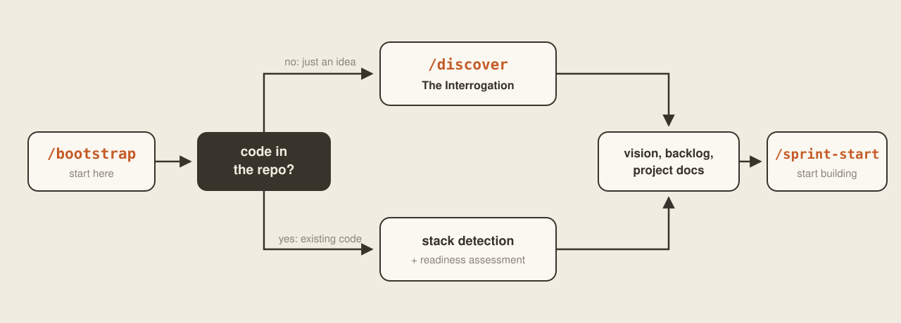
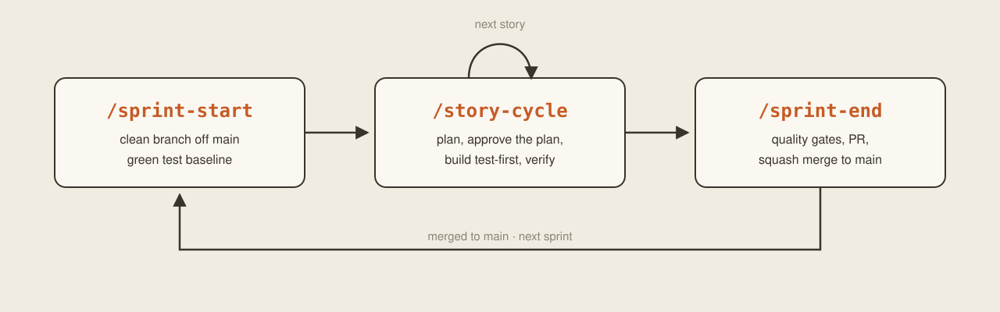
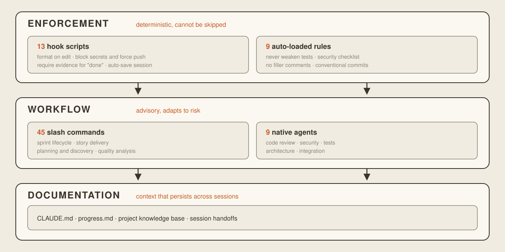

<p align="center">
  
</p>

<p align="center">
  One idea is enough. Exosuit wraps Claude Code in a full engineering organization: it interrogates your vision, pressure-tests every assumption, plans the build, and enforces tested, verified shipping.
</p>

<p align="center">
  <em>Founder who's never written code? Engineer with a million-line repo? Same suit. Your strength, amplified.</em>
</p>

<p align="center">
  <a href="https://github.com/joris887/exosuit/actions/workflows/ci.yml"></a>
  <a href="https://discord.gg/XqBnP6mydA"></a>
  <a href="https://github.com/joris887/exosuit/blob/main/LICENSE"></a>
  <a href="https://github.com/joris887/exosuit/releases"></a>
  <a href="https://claude.com/claude-code"></a>
  <a href="https://github.com/joris887/exosuit/stargazers"></a>
</p>

<p align="center">
  <a href="#install">Install</a>&nbsp;&nbsp;|&nbsp;&nbsp;<a href="docs/GETTING_STARTED.md">Getting Started</a>&nbsp;&nbsp;|&nbsp;&nbsp;<a href="docs/FRAMEWORK_REFERENCE.md">Full Reference</a>&nbsp;&nbsp;|&nbsp;&nbsp;<a href="https://discord.gg/XqBnP6mydA">Discord</a>&nbsp;&nbsp;|&nbsp;&nbsp;<a href="https://github.com/joris887/exosuit/issues">Issues</a>&nbsp;&nbsp;|&nbsp;&nbsp;<a href="CONTRIBUTING.md">Contributing</a>
</p>

---

<!-- demo GIF: assets/demo.gif — dropped in at launch -->

---

## The Problem

AI-assisted coding is powerful. It's also chaos.

Without structure, every Claude Code session drifts toward the same failure modes: scope creeps until the context window is exhausted. Tests get skipped because "the code looks right." Git history becomes a wasteland of `fix`, `update`, and `wip` commits. The AI claims "done" without running a single test. And when you start a new session, all context from the last one is gone.

You're not engineering software. You're prompting and hoping, generating plausible code with no discipline behind it.

This isn't a niche complaint. [Veracode's 2025 GenAI report](https://www.veracode.com/blog/genai-code-security-report/) found AI models introduce an OWASP Top-10 vulnerability in **45% of code tasks**, and [Stack Overflow's 2025 survey](https://survey.stackoverflow.co/2025/) found more developers actively **distrust** AI output accuracy (46%) than trust it (33%).

**Exosuit fixes this.** Not with guidelines the AI can ignore, but with deterministic hooks that physically block bad patterns, structured workflows that enforce TDD, and quality gates that require evidence before anything ships. **Hooks, not hopes.**

## What It Does

A drop-in development framework for [Claude Code](https://claude.com/claude-code) that adds 45 slash commands, 13 enforcement hooks, 9 specialized agents, and a complete sprint-based development workflow to any project. Install it in 30 seconds. Run `/bootstrap`. Start building like a professional.

- **Hooks block bad behavior:** force push, leaked secrets, skipped tests, premature "done" claims. These are deterministic shell scripts, not suggestions the AI can skip.
- **TDD is the default:** tests before implementation, always. The framework plans tests first, writes them first, then implements to pass them.
- **Sprints keep scope bounded:** small increments with forced checkpoints prevent the context window death spiral.
- **Git stays clean:** feature branches, conventional commits, squash merge to main. Dangerous commands are blocked at the hook level.
- **Sessions persist:** hand off with `/handoff`, resume with `/continue`. No context is lost between sessions.
- **Any language, any project:** Python, TypeScript, Go, Rust, Ruby, Java, PHP, Dart, C#, Swift, Kotlin, C/C++. The framework detects your stack and configures itself.
- **Verification is non-negotiable:** "it should work" is not accepted. Fresh test output is required before any completion claim.

One bet sits underneath all of it: **elicitation is mandatory** before code exists, and **enforcement is deterministic** while it is written. Everything else in the framework serves that pairing.

## Install

Into your project, existing repo or new. **macOS / Linux:**

```bash
curl -fsSL https://raw.githubusercontent.com/joris887/exosuit/main/install.sh | bash
```

**Windows** (needs [Git for Windows](https://git-scm.com/download/win), which Claude Code requires anyway):

```powershell
powershell -ExecutionPolicy Bypass -c "irm https://raw.githubusercontent.com/joris887/exosuit/main/install.ps1 | iex"
```

Then open Claude Code in your project. Your first command is `/bootstrap`, and that is your first session, below.

## Your First Session

After install, everything starts with `/bootstrap`. What happens next depends on your situation:

<p align="center">
  
</p>

**Take your time with this step.** Bootstrap is thorough on purpose. For a new project it starts the discovery interview, and that can take an hour or more. This is deliberate. It is where the deep elicitation happens: expect questions about your idea that you have never asked yourself, and your honest answers become the foundation of everything the framework builds afterwards. Rushing here trades an hour of thinking for weeks of building the wrong thing. For an existing repo, bootstrap researches your codebase, maps the gaps between your current setup and the framework's engineering principles, and generates your project documentation; how long that takes scales with the size of your repo.

### New project from an idea

`/bootstrap` detects an empty project and launches `/discover`, **The Interrogation**: a deep, research-backed elicitation that pressure-tests your idea before a single line of code exists. It challenges your assumptions, runs a pre-mortem, and makes you declare kill criteria. Your project is built from what survives:

```
What are you building?
> "A neighborhood power grid where every solar roof, home battery,
>  and parked EV trades energy automatically"

Phase 1: Classification ███░░░░░░░░░░░░░░░░░ 1/7
  → Marketplace archetype, Platform scale (recommended, you confirm)

Phase 2: Core Identity ██████░░░░░░░░░░░░░░ 2/7
  [researching the energy-trading landscape...]
  Who sets the price when your neighbor's battery powers your kettle?
  Is the utility company your partner, your rival, or your customer?

Phase 3: Deep Elicitation █████████░░░░░░░░░░░ 3/7
  [feature map: MUST / IMPORTANT / NICE / CUT]
  [edge cases: what happens on a still, cloudy week in January?]
  [user personas drafted from your answers, you confirm]

Phase 4: Stress Testing ████████████░░░░░░░░ 4/7
  [rating assumptions, researching the unknowns]
  [pre-mortem: what kills this project?]
  [No-Gos: what you are explicitly not building]

Phases 5-7: tech decisions → vision pitch → MVP scoping
  → Backlog: sized epics and stories, setup stories for external services
  → Ready for /sprint-start
```

This is not a generic questionnaire. `/discover` selects from **11 project archetypes** (utility, marketplace, developer tool, creative expression, etc.) and asks questions specific to your project type.

### Existing project with code

`/bootstrap` researches your repository, then walks you through the decisions that matter: development profile, ground rules, quality tooling. Detection is automatic; the decisions stay yours:

```
Detecting stack...
  Language:    Python 3.12
  Framework:   FastAPI
  Tests:       pytest (127 tests, 72% coverage)
  Formatter:   ruff
  Linter:      ruff
  Type check:  not configured
  CI:          not found

Codebase health...
  14,200 LOC across 87 files
  3 files over 500 LOC, 12 technical debt items

Profile: Standard (recommended from project signals, you confirm)

Generating configuration...
  ✓ CLAUDE.md configured
  ✓ Architecture documented from the actual import graph
  ✓ Coding standards + testing strategy populated
  ✓ Ground rules established (interactive)

Framework Readiness Report:
  TDD-first        ✓ Ready    pytest, 72% coverage baseline
  Git-disciplined  ✓ Ready    main branch, remote configured
  Type-safe        ⚠ Risk     no type checker configured
  CI-enforced      ✗ Missing  no CI pipeline found
  ...11 more principles assessed

Foundation backlog, dependency-ordered:
  E00-S01  Add type checking (mypy)     Level 0: tools
  E00-S02  Configure GitHub Actions CI  Level 3: structure
  Framework Ready Gate after Level 2
```

The framework tells you exactly what your project needs to be production-ready, then generates stories to get there, ordered so each level unlocks the next.

## The Sprint Loop

After bootstrap, everything ships through the same loop of three commands. This is the framework's heartbeat:

<p align="center">
  
</p>

Inside the loop, every step earns its place:

```
/sprint-start
  Pre-flight   open PRs handled, working tree clean, main pulled and green
  Planning     you pick ready stories, set one sprint goal, keep buffer capacity
  Branch       sprint-N created; main stays untouched from here on

/story-cycle E01-S01                        (repeat, one story at a time)
  Phase 0  Decompose   size the story (TRIVIAL to XL) and score its risk
  Phase 1  Plan        research the codebase, check ground rules, write the plan
                       HARD GATE: you approve the plan before any code exists
  Phase 2  Readiness   five checks with evidence: planned files read, tests
                       green, existing pattern cited, scope bounded, no rule
                       conflicts. A failed check goes back to planning, not code
  Phase 3  Build       HARD GATE: tests before implementation
                       features: TDD | bugs: reproduce first | refactors:
                       characterization tests
  Phase 4  Verify      self-review, quality agents scaled to risk, fresh
                       evidence for every acceptance criterion, then a
                       conventional commit

/sprint-end
  Quality gates   full test suite, test-count protection, review agents
  Documentation   epics, backlog, progress, and metrics updated
  Ship            PR created, CI awaited, squash merge to main,
                  branch deleted, sprint summarized
```

TRIVIAL changes fast-track through a single lite pass. High-risk changes get extra scrutiny whatever their size. Between sessions, `/handoff` and `/continue` keep the loop running without losing context.

## Architecture

Three layers, from most to least deterministic:

<p align="center">
  
</p>

Key insight: the enforcement layer is deterministic; hooks are shell scripts that the AI cannot bypass. The workflow layer is advisory; it guides but doesn't force. When something *must* happen, it lives in enforcement.

## Profiles

Not every project needs the same ceremony. During `/bootstrap` you pick one of three profiles: **Lean** for prototypes (plan, build, verify), **Standard** for production work (the full loop above), or **Strict** for regulated systems (every gate mandatory, plus an audit trail). The workflow scales; the safety net never does. Secrets detection, dangerous command blocking, and git protection are always on. Change your profile anytime in CLAUDE.md.

## When It Steps In

Most of the time you will not notice the enforcement layer. It formats every edit, scans every change for secrets, and saves your session state without saying a word. You notice it the moment something risky happens:

```
AI: git push --force origin main

BLOCKED: git push --force is not allowed. Use --force-with-lease if necessary.
  WHY: Force-push rewrites the remote branch history. If anyone has pulled
  your branch, their local copy will break with no way to reconcile.
```

```
AI: "All tests pass, marking this story complete."

Quality check before completion:
  - Task claimed complete but no test output found. Run tests and show output.
  WHY: The framework requires evidence that tests pass before marking work
  complete. This prevents shipping untested code.
```

Both messages are real hook output, not paraphrase. The full net: dangerous git commands and destructive shell patterns are stopped before they execute. Every edit is auto-formatted and scanned for credentials the moment it lands. "Done" is rejected until the tests have actually run in the current session. Session state is saved before every stop, so a crash or a closed laptop costs you nothing.

These are exit-code shell scripts wired into Claude Code's hook events. There is no rule to ignore and no instruction to drift from. The command simply does not run.

## All Commands

### Core Workflow
| Command | What it does |
|---|---|
| `/bootstrap` | First-run setup: detect stack, configure framework, assess readiness |
| `/quickstart` | Guided tour of the framework before your first sprint |
| `/discover` | The Interrogation: deep guided elicitation for new projects (11 archetypes) |
| `/sprint-start` | Create sprint branch, select stories |
| `/story-cycle` | Deliver a story with TDD + quality gates |
| `/sprint-end` | Quality gates → PR → merge to main |
| `/pr-status` | Check open PRs and decide next steps |
| `/continue` | Resume exactly where you left off |
| `/handoff` | Save session state for next time |

### Planning & Design
| Command | What it does |
|---|---|
| `/ideate` | Decompose ideas into sized, estimated stories |
| `/backlog-review` | Audit backlog health: story quality, readiness, staleness |
| `/brainstorm` | Explore designs, tradeoffs, approaches |
| `/research` | Deep web + codebase research with source citations |
| `/phase-review` | Evaluate what you built, plan the next phase |

### Quality & Testing
| Command | What it does |
|---|---|
| `/quality-check` | Run all quality gates manually |
| `/code-quality` | Deep code review with multi-agent analysis |
| `/security-audit` | Security-focused review (OWASP, CWE) |
| `/architecture-check` | Verify architecture against ground rules |
| `/test-validator` | Check coverage and assertion quality; detects weakened tests |
| `/performance-check` | Find N+1 queries, blocking I/O, memory leaks, scaling issues |
| `/testing-cycle` | Process test feedback into fixes |
| `/UAT-cycle` | User acceptance test case execution |
| `/claude-sense-check` | Batch-verify UAT test cases against actual code |
| `/manual-test` | Generate test plans for manual verification |

### Debugging & Recovery
| Command | What it does |
|---|---|
| `/debug-session` | Structured debugging with hypothesis tracking |
| `/fix-issue` | Fix a GitHub issue (reads context, plans, implements, PRs) |
| `/undo-work` | Safely revert failed implementations |

### Guided Experiences
| Command | What it does |
|---|---|
| `/build` | Build from plain English; handles everything automatically |
| `/deploy` | Guided deployment setup |
| `/dashboard` | Visual overview of sprint progress and project health |
| `/help-me` | Context-aware help |

### Maintenance & Utilities
| Command | What it does |
|---|---|
| `/doctor` | Framework health check and diagnostics |
| `/retrospective` | Sprint retro with metric analysis |
| `/weekly-maintenance` | Dependency updates, debt tracking, rule health |
| `/parallel-work` | Work on multiple stories at once in isolated parallel streams |
| `/merge-up` | Publish a stream's finished work to the branch it came from |
| `/merge-down` | Pull the parent branch's accumulated work into a stream |
| `/commit` | Conventional commit with quality checks |
| `/refine-loop` | Iterative refinement until criteria met |
| `/optimize` | Optimize a specific metric (performance, bundle size, etc.) |
| `/framework-upgrade` | Upgrade framework to latest version |
| `/skill-create` | Generate project-specific skills from codebase analysis |
| `/skill-eval` | Evaluate skill effectiveness with metrics |
| `/custom-hooks` | Create and register project-specific hooks |
| `/uninstall` | Cleanly remove the framework, keeping your project intact |

## Design Philosophy

The framework is built on a simple observation: **AI is great at generating code, but terrible at engineering discipline.** It doesn't protect existing tests, respect architectural boundaries, verify its own claims, or maintain conventions. On a weekend script you can live with that. On anything meant to last, whether that is your startup's first product or a codebase a whole team depends on, it becomes a cycle of building and breaking.

The framework solves this with three ideas:

1. **Enforce what matters.** If something must happen (format code, scan for secrets, verify before "done"), it goes in the enforcement layer as a deterministic hook. The AI cannot skip it.

2. **Guide everything else.** If something should happen (TDD workflow, confidence gates, sprint structure), it goes in the workflow layer as a skill. The AI follows it because the methodology is sound, but nothing breaks if a step is adapted.

3. **Adapt to the project.** A hackathon prototype and a regulated medical system need different amounts of ceremony. Three profiles (Lean, Standard, Strict) scale the workflow. Per-story risk calibration adds scrutiny where it matters, regardless of profile.

## Prerequisites

- **[Claude Code](https://claude.com/claude-code)**, installed and working
- **Git**, configured with your identity
- **[GitHub CLI](https://cli.github.com/)** (`gh`) for PR workflow and issue management
- **A Claude plan that fits the workload.** Exosuit is thorough by design, and thoroughness spends tokens. **Claude Max is recommended** for daily development; Pro is enough to evaluate the framework on the Lean profile. See the [FAQ](#faq) for honest details.

No language runtimes required. The framework itself is pure POSIX shell and markdown.

## FAQ

<details>
<summary><strong>Does this work with my language?</strong></summary>

Yes. `/bootstrap` auto-detects your stack and configures the tools it finds (offering to install missing ones):

| Language | Formatter | Linter | Test Runner | Type Checker |
|---|---|---|---|---|
| Python | ruff | ruff | pytest | mypy / pyright |
| TypeScript | prettier | eslint | vitest / jest | tsc |
| JavaScript | prettier | eslint | vitest / jest | — |
| Go | gofmt | golangci-lint | go test | (built-in) |
| Rust | rustfmt | clippy | cargo test | (built-in) |
| Ruby | rubocop | rubocop | rspec / minitest | sorbet |
| Java | google-java-format | checkstyle | junit / maven | (built-in) |
| C# | dotnet format | dotnet analyzers | dotnet test | (built-in) |
| PHP | php-cs-fixer | phpstan | phpunit | phpstan |
| Dart | dart format | dart analyze | dart test | (built-in) |
| Swift | swift-format | swiftlint | XCTest | (built-in) |
| Kotlin | ktlint | detekt | junit | (built-in) |
| C/C++ | clang-format | clang-tidy | ctest / gtest | — |

If your language isn't listed, the safety hooks and workflow still work; you just won't get auto-formatting.
</details>

<details>
<summary><strong>How is this different from BMAD, spec-kit, Superpowers, or CCPM?</strong></summary>

They're good tools built by people who care about the same problem. [BMAD-METHOD](https://github.com/bmad-code-org/BMAD-METHOD) pioneered deep agile planning with specialized agents, [Superpowers](https://github.com/obra/superpowers) made a skills-based methodology feel native to Claude Code, GitHub's [spec-kit](https://github.com/github/spec-kit) brought spec-driven development to the mainstream, [CCPM](https://github.com/automazeio/ccpm) coordinates parallel agents through GitHub Issues, [SuperClaude](https://github.com/SuperClaude-Org/SuperClaude_Framework) shows how far behavioral configuration can go, and [tdd-guard](https://github.com/nizos/tdd-guard)/[Probity](https://github.com/nizos/probity) built serious deterministic TDD gates. If one of those matches how you work, use it.

Exosuit's bet is a specific combination none of them focuses on. Elicitation is mandatory: The Interrogation happens before code exists, and everything it produces persists into files that every later command actually reads. Enforcement is deterministic: exit-code hooks rather than instructions the model can drift away from. If you build or maintain one of these projects, there's an open door in [Discussions](https://github.com/joris887/exosuit/discussions).
</details>

<details>
<summary><strong>Can I use this with Cursor, Windsurf, or other AI tools?</strong></summary>

The skills (slash commands) are Claude Code-specific. However, `AGENTS.md` is symlinked to `CLAUDE.md`, so tools that read `AGENTS.md` for project context get the full project configuration. The documentation layer (architecture, coding standards, ground rules) works with any tool.
</details>

<details>
<summary><strong>What if bootstrap gets something wrong?</strong></summary>

Edit `CLAUDE.md` directly; it's the source of truth for project configuration. Or re-run `/bootstrap` anytime for a fresh detection. Nothing is locked in.
</details>

<details>
<summary><strong>How do I customize the framework?</strong></summary>

Everything is plain markdown and shell scripts. Edit directly:
- **Skills** (`.claude/skills/{name}/SKILL.md`): modify workflow behavior
- **Rules** (`.claude/rules/*.md`): add or change enforcement rules
- **Hooks** (`.claude/hooks/rules/*.yaml`): configure hook behavior
- **Personal overrides** (`CLAUDE.local.md`): project-specific overrides that aren't committed
</details>

<details>
<summary><strong>Does this support parallel work on multiple stories?</strong></summary>

Yes, when the stories are independent. `/parallel-work` creates isolated streams (git worktrees) from your sprint branch, one story each, and checks first that the stories don't depend on each other or touch the same files. Inside a stream, `/merge-up` publishes finished work to the sprint branch and `/merge-down` pulls in what other streams have shipped. `/sprint-end` verifies every stream is merged before it ships, and cleans them up. Sequential single-branch work stays the default; parallel is opt-in.
</details>

<details>
<summary><strong>What if my session ends mid-story?</strong></summary>

The framework auto-saves state before every session end. Resume with `/continue`; it detects exactly where you left off, including the current phase, branch, and plan.
</details>

<details>
<summary><strong>Is this overkill for small projects?</strong></summary>

Use the **Lean** profile. It strips ceremony to the minimum (plan → build → verify) while keeping the safety net (secrets, git protection, formatting). The framework adapts to your needs, not the other way around.
</details>

<details>
<summary><strong>What's the context window cost?</strong></summary>

~100 lines for `CLAUDE.md` (loaded every session) + ~140 lines for always-active rules. Skills load on-demand only when invoked. The framework is designed to be context-efficient; it loads less than many project README files.
</details>

<details>
<summary><strong>Do I need a Claude Max subscription?</strong></summary>

Recommended for serious use, honestly. Exosuit's value comes from doing the work most setups skip: The Interrogation researches and challenges your idea, quality gates dispatch review agents, and verification re-runs your tests before anything is called done. All of that spends tokens.

- **Claude Max:** recommended for daily development and full sprints.
- **Claude Pro:** fine for evaluating the framework and lighter projects. Pick the **Lean** profile during `/bootstrap` and expect to hit session limits on long builds.
- **API billing:** works too; cost scales with how much of the workflow you use.

Token efficiency is a known optimization area. Context budgets are already enforced (on-demand skill loading, priority-based compaction), and making the framework substantially leaner is on the roadmap. But today, don't bring a Pro plan to a Max-sized sprint.
</details>

## Contributing

See [CONTRIBUTING.md](CONTRIBUTING.md) for setup, development workflow, and PR guidelines.

Found a bug or have an idea? [Open an issue](https://github.com/joris887/exosuit/issues).

## License

Licensed under the [MIT License](LICENSE).
