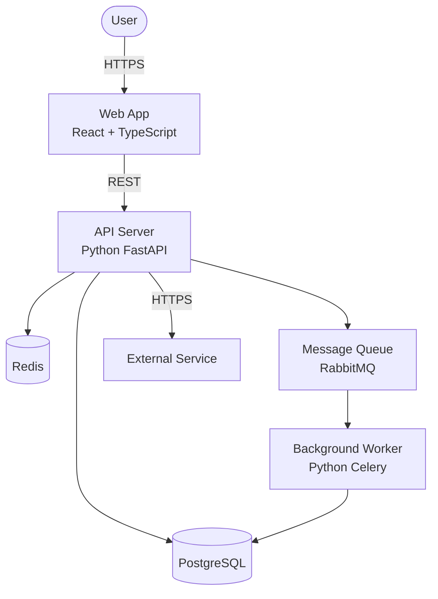
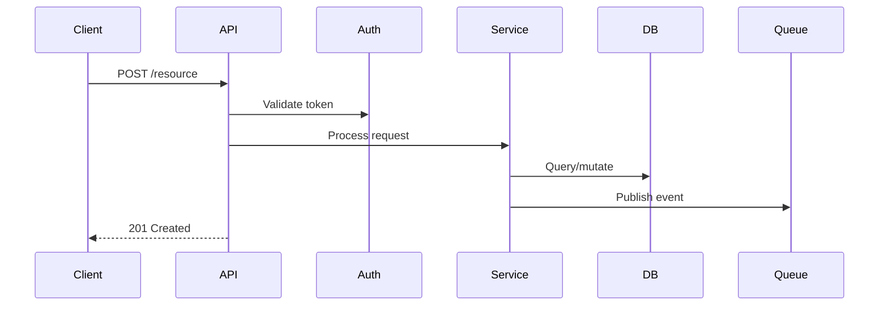

# [Project Name] — Architecture

<!-- Generated by /bootstrap from codebase analysis. Budget: ≤200 lines. -->
<!-- Last Verified: YYYY-MM-DD | Framework Version: [version] -->
<!-- REVIEW-NEEDED: update when adding modules, changing data stores, or modifying API boundaries -->

<!-- bootstrap: 2-3 sentences. What the system does, who it serves, primary architectural style. -->
<!-- Focus on WHAT and WHY, not HOW — the code shows how. -->

## Tech Stack

<!-- bootstrap: detect from package files, config, and source code -->
<!-- Only list what's non-obvious — AI discovers standard tooling on its own -->

| Layer | Technology | Notes |
|-------|-----------|-------|
| Language | <!-- e.g., Python 3.12 --> | |
| Framework | <!-- e.g., FastAPI --> | |
| Database | <!-- e.g., PostgreSQL 16 --> | |
| Cache | <!-- e.g., Redis --> | <!-- omit row if none --> |
| Queue | <!-- e.g., RabbitMQ --> | <!-- omit row if none --> |
| Frontend | <!-- e.g., React 18 + TypeScript --> | <!-- omit row if none --> |

## Architecture Overview

<!-- bootstrap: generate from detected modules, entry points, and dependencies -->
<!-- Use flowchart TD with C4-style labels — NOT Mermaid's experimental C4 syntax -->
<!-- Show: actors, deployable units, data stores, external systems, protocols -->

<!-- bootstrap: replace the example above with actual detected architecture -->
<!-- Small projects (CLI, library): a single box with inputs/outputs is fine -->
<!-- Monorepos: one subgraph per package/service -->

## Module Map

<!-- bootstrap: map top-level directories to responsibilities -->
<!-- Format: directory → responsibility. Only list directories that contain meaningful modules. -->

| Directory | Responsibility | Key Entry Point |
|-----------|---------------|-----------------|
| `src/api/` | <!-- e.g., HTTP handlers, routing --> | `src/api/main.py` |
| `src/services/` | <!-- e.g., Business logic, orchestration --> | |
| `src/models/` | <!-- e.g., Domain entities, DB schemas --> | |
| `src/workers/` | <!-- e.g., Async job processing --> | |

### Dependency Rules

<!-- bootstrap: infer from import analysis. Use imperative language — these are rules, not descriptions. -->
<!-- AI follows explicit rules more reliably than descriptive prose. -->

- Controllers/handlers MUST only call services. Controllers NEVER import repositories or models directly.
- Services MAY call other services and repositories. Services NEVER import controllers.
- Repositories MUST only access the data layer. Repositories NEVER contain business logic.
- Shared types live in `src/types/` or `src/models/` — NEVER define types locally then import across modules.

<!-- bootstrap: replace examples with actual detected dependency patterns -->
<!-- Small projects: 2-3 rules is fine. Skip this subsection if single-module. -->

## Key Data Flow

<!-- bootstrap: identify the primary business operation and trace it through the system -->
<!-- One sequence diagram showing the most representative request lifecycle -->

<!-- bootstrap: replace with actual primary flow (e.g., user login, order creation, data pipeline run) -->
<!-- Small projects: skip this section if there's only one component -->

## Constraints

<!-- bootstrap: detect from config, CI, compliance markers, or ask the user -->
<!-- These are non-negotiable requirements — not aspirational goals -->

| ID | Category | Constraint | Rationale |
|----|----------|-----------|-----------|
| C-1 | <!-- e.g., Performance --> | <!-- e.g., API p95 < 200ms --> | <!-- e.g., SLA requirement --> |
| C-2 | <!-- e.g., Security --> | <!-- e.g., All data encrypted at rest --> | <!-- e.g., SOC2 compliance --> |
| C-3 | <!-- e.g., Compatibility --> | <!-- e.g., Must support Node 18+ --> | <!-- e.g., LTS policy --> |

<!-- bootstrap: omit this section for new/small projects with no known constraints -->

## Key Decisions

<!-- bootstrap: extract from ADRs if docs/decisions/ exists, otherwise from code patterns -->
<!-- Format: what was decided, why, and what was traded away -->

| Decision | Choice | Why | Trade-off |
|----------|--------|-----|-----------|
| <!-- e.g., API style --> | <!-- e.g., REST --> | <!-- e.g., Broad client support --> | <!-- e.g., No streaming --> |
| <!-- e.g., ORM --> | <!-- e.g., None (raw SQL) --> | <!-- e.g., Performance control --> | <!-- e.g., More boilerplate --> |
| <!-- e.g., Auth --> | <!-- e.g., JWT + refresh tokens --> | <!-- e.g., Stateless scaling --> | <!-- e.g., Token revocation complexity --> |

<!-- Full ADRs: docs/adr/ADR-NNNN-title.md (if directory exists) -->

## Quality Attributes

<!-- bootstrap: infer from test config, CI pipeline, monitoring setup -->
<!-- Top 3-5 quality attributes that should guide code decisions -->

| Attribute | Requirement | Priority |
|-----------|------------|----------|
| <!-- e.g., Testability --> | <!-- e.g., All business logic unit-testable without infrastructure --> | <!-- e.g., P0 --> |
| <!-- e.g., Reliability --> | <!-- e.g., Graceful degradation when external services are down --> | <!-- e.g., P1 --> |
| <!-- e.g., Maintainability --> | <!-- e.g., New developer productive within 1 day --> | <!-- e.g., P1 --> |

<!-- bootstrap: omit for small projects. Ground rules in docs/reference/GROUND_RULES.md cover similar ground. -->

## Cross-Cutting Concerns

<!-- bootstrap: detect from codebase patterns — grep for error handling, logging, auth, validation -->
<!-- One line each. These span module boundaries and are hard to discover consistently from code. -->

- **Error handling:** <!-- e.g., All errors wrapped in AppError with error codes; global handler in middleware -->
- **Logging:** <!-- e.g., Structured JSON via winston/structlog; correlation IDs on all requests -->
- **Authentication:** <!-- e.g., JWT validated in middleware; roles checked per-endpoint -->
- **Validation:** <!-- e.g., Zod/Pydantic at API boundary; domain types enforce invariants -->
- **Configuration:** <!-- e.g., Environment variables via dotenv; no secrets in code -->

<!-- bootstrap: omit lines for concerns that don't apply (e.g., no auth for a CLI tool) -->

## Known Landmines

<!-- bootstrap: flag from code comments (TODO, HACK, FIXME), test skips, and unusual patterns -->
<!-- These prevent AI from making the same mistakes human developers have already encountered. -->
<!-- This is the HIGHEST-VALUE section — information invisible in code structure. -->

- <!-- e.g., `src/legacy/parser.py` uses a custom date format (DD-MM-YYYY) that breaks if you pass ISO dates -->
- <!-- e.g., The `users` table has a soft-delete column (`deleted_at`) — queries MUST filter on it -->
- <!-- e.g., CI runs against a shared staging DB — never run migrations in parallel -->
- <!-- e.g., The `/health` endpoint bypasses auth middleware intentionally — don't "fix" this -->

<!-- bootstrap: start empty if no landmines detected. Developers add entries as they discover gotchas. -->

## Update Triggers

<!-- This section signals when the document needs revision. -->
<!-- sprint-end checks these triggers to detect architectural drift. -->

Update this document when:

- A new top-level module or service is added
- A data store is added, removed, or replaced
- An external dependency or API boundary changes
- A dependency rule in Module Map is violated intentionally (update the rule, create an ADR)
- The deployment topology changes (new environments, new infrastructure)
