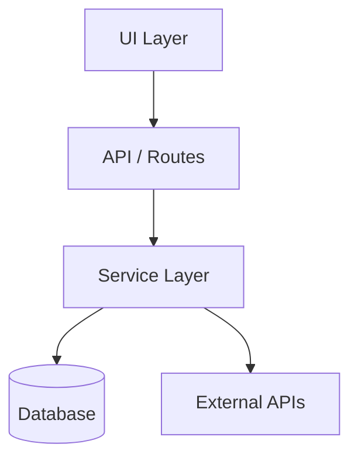
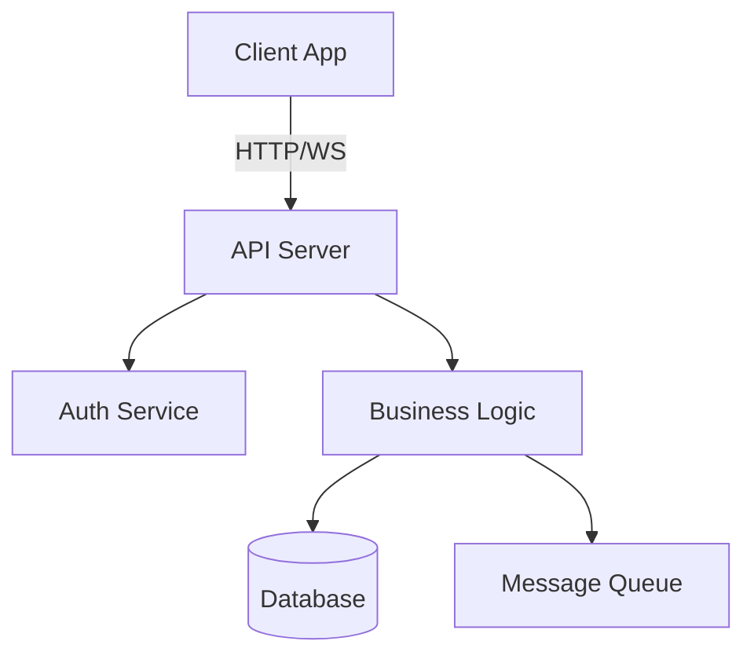
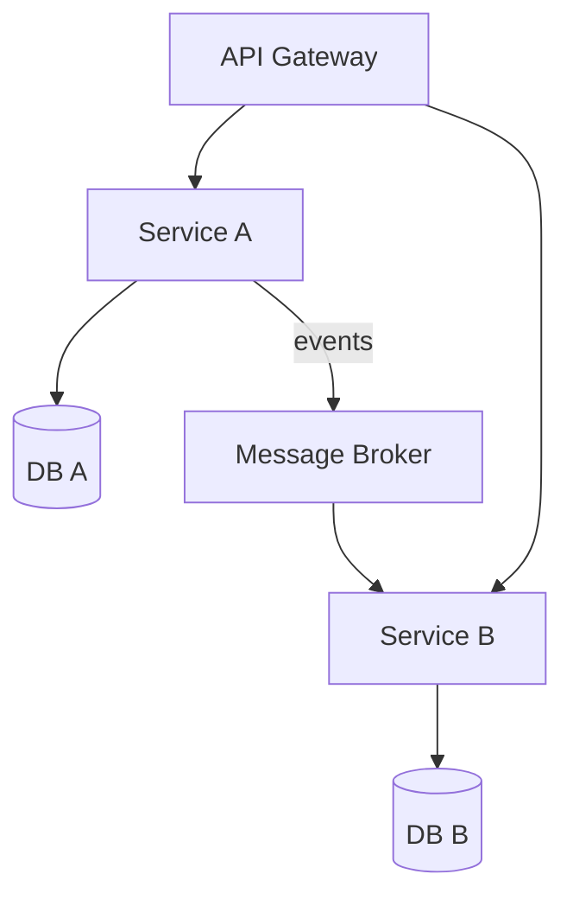

# System Architecture

<!-- Generated by /bootstrap from vision/ content, or written manually -->

## Overview

<!-- High-level description of the system architecture -->

## Component Diagram

<!-- Replace with your project's architecture. Mermaid examples below — pick the closest pattern and customize. -->

<!-- Monolith / Single App:

-->

<!-- Client-Server:

-->

<!-- Microservices:

-->

## Key Components

### Component 1

- **Purpose:**
- **Technology:**
- **Key files:**

### Component 2

- **Purpose:**
- **Technology:**
- **Key files:**

## Data Flow

<!-- How data moves through the system -->

## Key Decisions

See `docs/adr/` for Architecture Decision Records.

## Constraints

<!-- Technical constraints, performance requirements, security requirements -->
<!-- Examples:
- **Memory:** Application must stay within Xmb baseline
- **Latency:** API responses < Xms at p95
- **Availability:** 99.X% uptime target
- **Data:** All user data encrypted at rest
- **Compliance:** GDPR / SOC2 / HIPAA requirements
-->

## Dependencies

<!-- External services, libraries, and infrastructure -->
