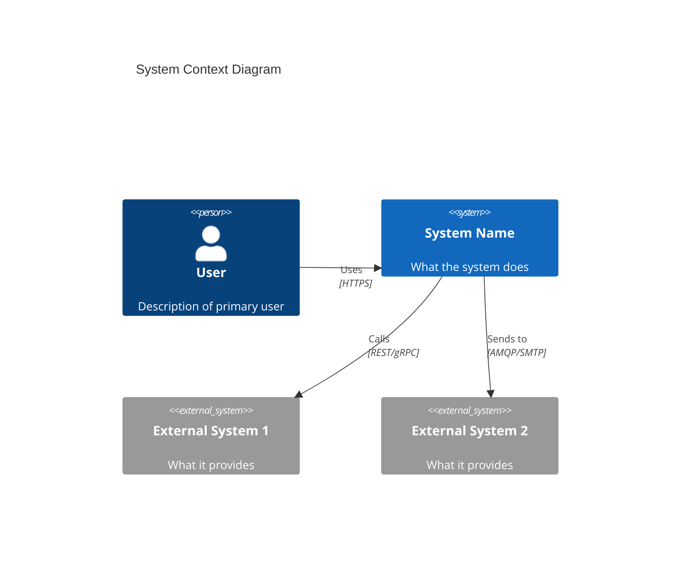
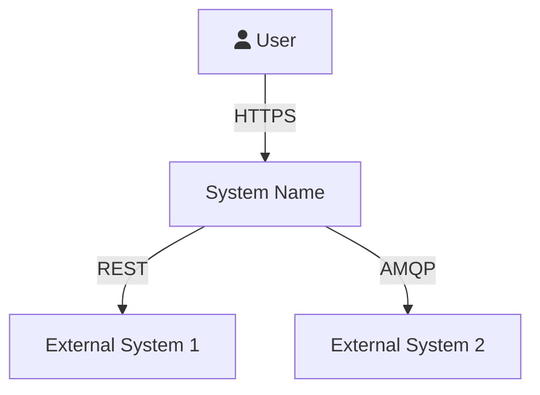
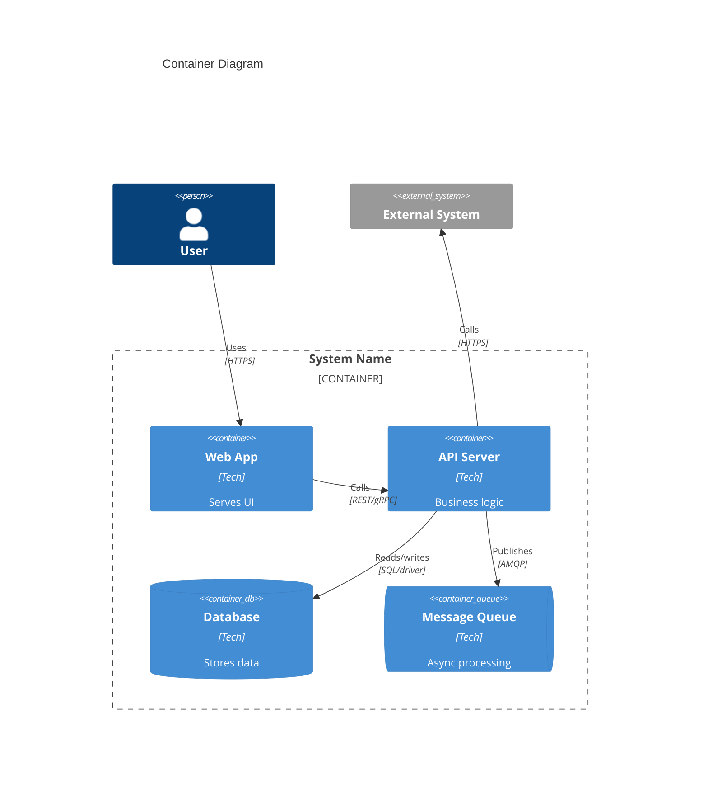
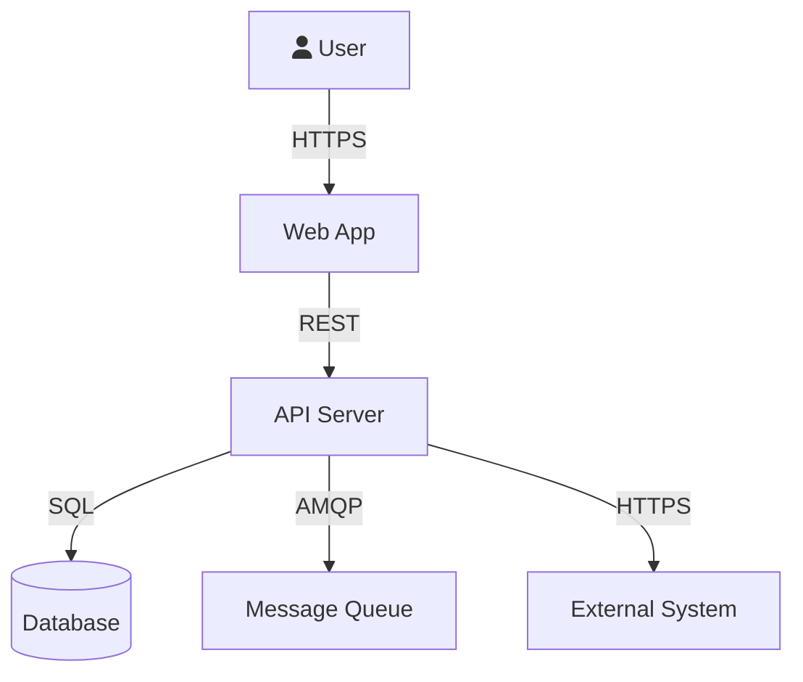
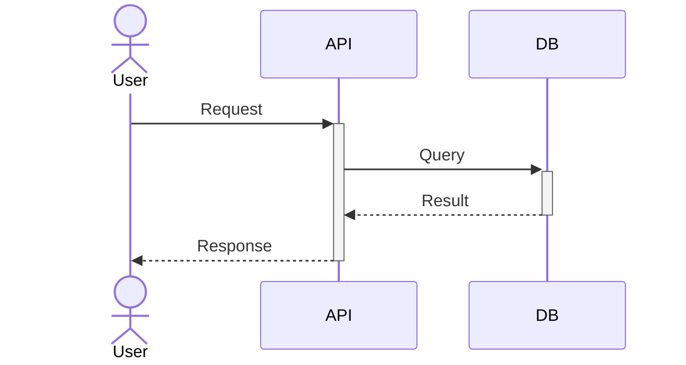

# System Architecture

<!-- Generated by /bootstrap from vision/ content, or written manually -->
<!-- Uses C4 model levels 1-2 for structured architecture views -->
<!-- Budget: keep under 200 lines total (see documentation.md rule) -->

## Overview

<!-- 2-3 sentences: what the system does, who it serves, what makes it architecturally interesting -->

## System Context (C4 Level 1)

<!-- The system as a black box, showing external actors and dependencies -->

<!-- If C4Context is not rendered by your Mermaid version, use this fallback:

-->

## Container View (C4 Level 2)

<!-- Major deployable units: apps, services, databases, message queues -->

<!-- Fallback if C4Container is not supported:

-->

## Key Components

<!-- One subsection per major component. Keep to 3-5 lines each. -->

### [Component Name]

- **Purpose:** What it does and why it exists
- **Technology:** Language, framework, runtime
- **Key files:** `src/path/to/entry.ext`
- **Interfaces:** What it exposes (REST endpoints, CLI commands, event topics)

### [Component Name]

- **Purpose:**
- **Technology:**
- **Key files:**
- **Interfaces:**

## Data Flow

<!-- How a typical request moves through the system. Use a sequence diagram for complex flows. -->

## Technology Decisions

<!-- Top 3-5 decisions with brief rationale. Full details in docs/adr/ -->

| Decision | Choice | Rationale |
|----------|--------|-----------|
| Language | <!-- e.g., Go --> | <!-- e.g., Performance + team expertise --> |
| Database | <!-- e.g., PostgreSQL --> | <!-- e.g., Relational model fits domain --> |
| API style | <!-- e.g., REST --> | <!-- e.g., Broad client compatibility --> |

See `docs/adr/` for full Architecture Decision Records.

## Infrastructure & Deployment

<!-- How and where the system runs -->

- **Environment(s):** <!-- dev, staging, production -->
- **Hosting:** <!-- cloud provider, self-hosted, serverless -->
- **CI/CD:** <!-- pipeline tool and trigger strategy -->
- **Observability:** <!-- logging, metrics, tracing tools -->

## Constraints

<!-- Non-negotiable requirements that shape architecture -->

| Category | Constraint |
|----------|-----------|
| Performance | <!-- e.g., API responses < 200ms at p95 --> |
| Availability | <!-- e.g., 99.9% uptime --> |
| Security | <!-- e.g., All data encrypted at rest, OAuth2 required --> |
| Compliance | <!-- e.g., GDPR, SOC2, HIPAA --> |
| Scale | <!-- e.g., 10k concurrent users --> |

## External Dependencies

<!-- Services and systems this project depends on but does not control -->

| Dependency | Purpose | Failure Impact |
|-----------|---------|----------------|
| <!-- e.g., Stripe --> | <!-- Payment processing --> | <!-- Users cannot checkout --> |
| <!-- e.g., SendGrid --> | <!-- Email delivery --> | <!-- Notifications delayed --> |
