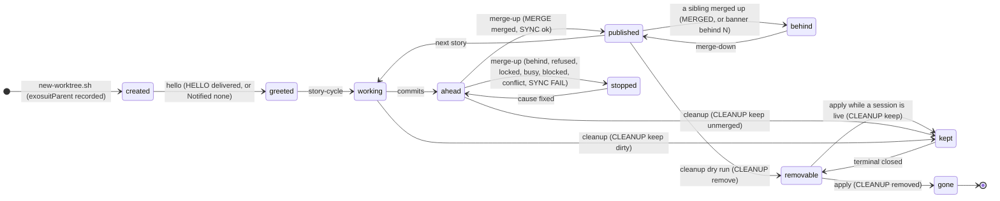
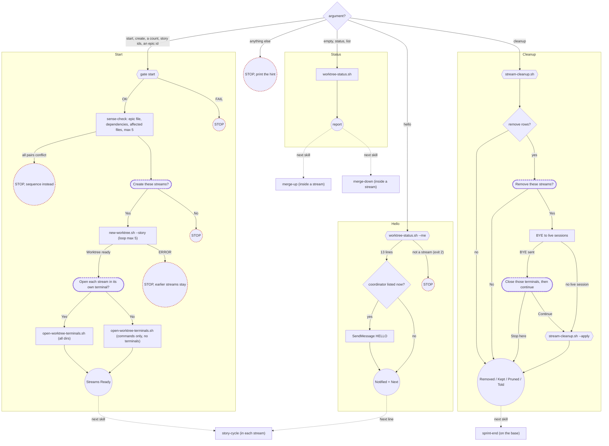
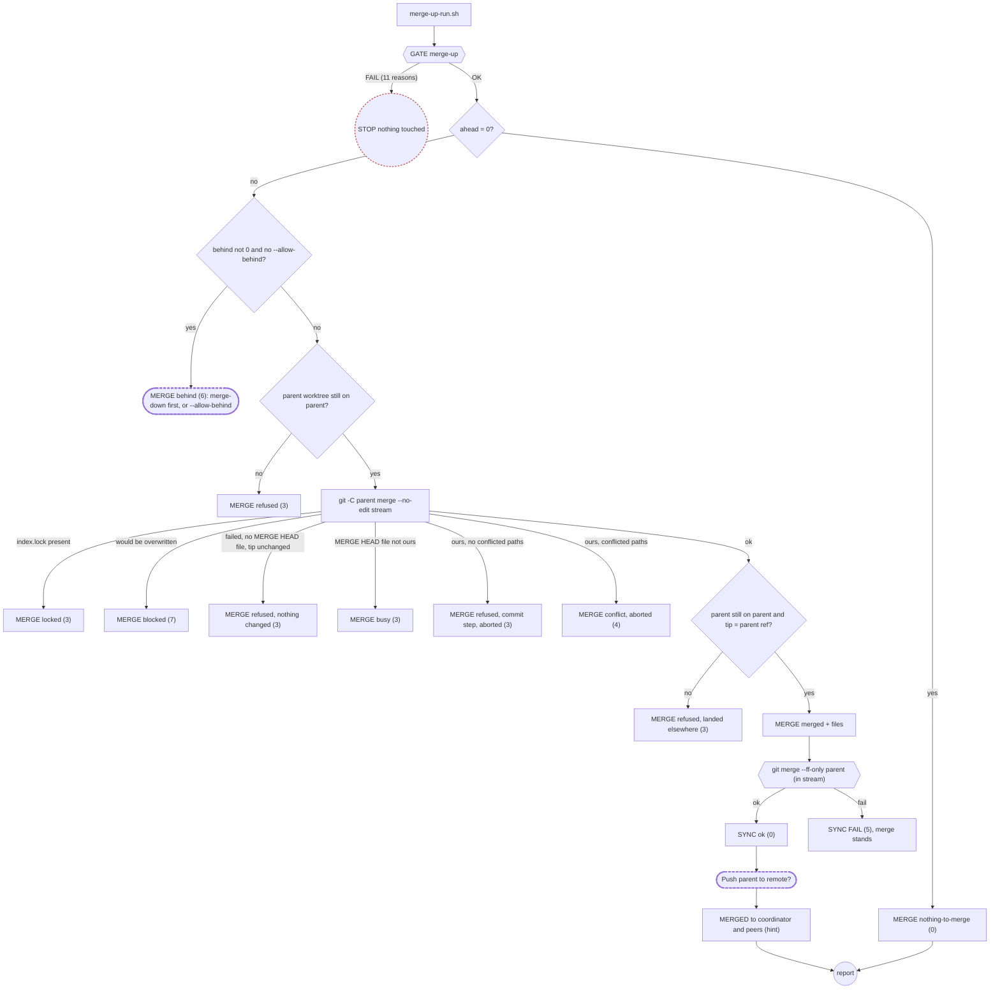
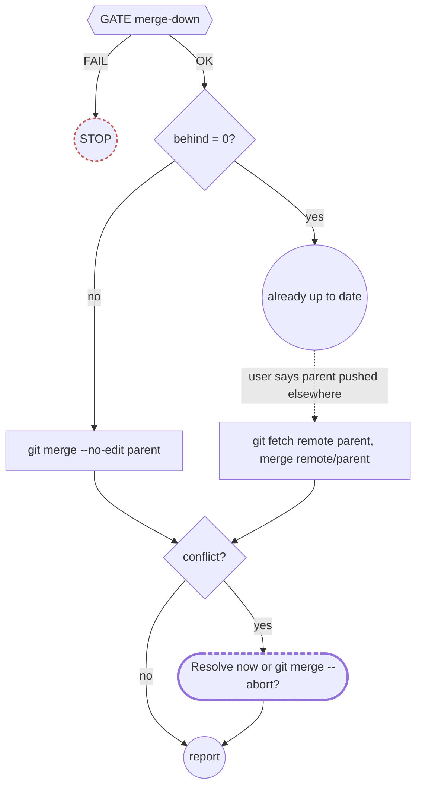
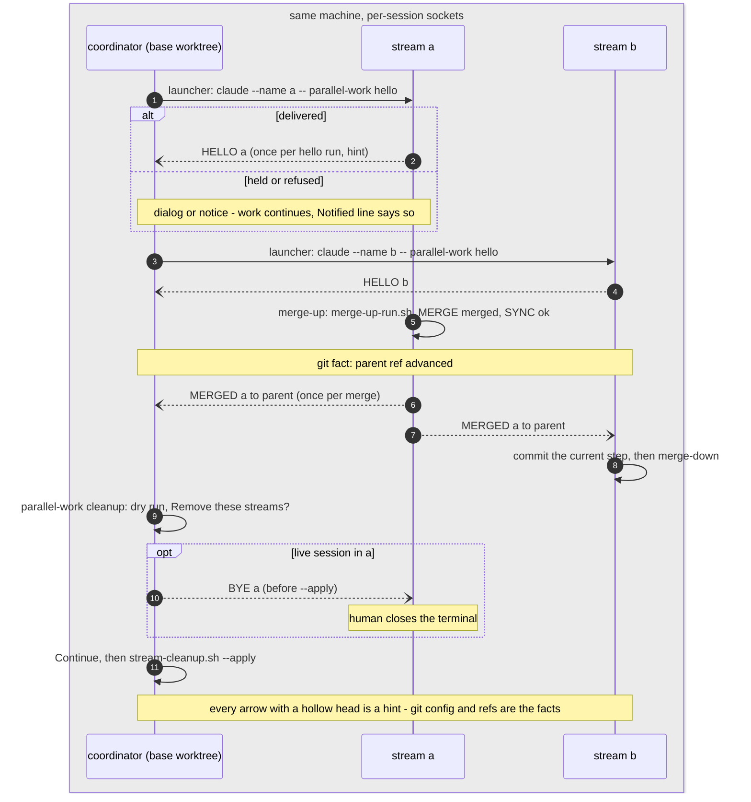

# Parallel streams — how the family works

A stream is a sibling git worktree (`../<repo>-<branch>`, `/` in the branch written as `-`) on its own branch, with `branch.<b>.exosuitParent` recorded, opened in its own terminal as a named Claude session. Parallel streams are opt-in and never required: sequential work is the default, outcome matters more than output, and when in doubt, sequence. Five scripts compute every git fact and print fixed verdict lines (`GATE`, `MERGE:`, `SYNC:`, `CLEANUP:`); the model executes them and pastes their output, and never re-derives or re-interprets what a script printed. The hints the sessions exchange (HELLO, MERGED, BYE, NOTE) never approve, run, configure or decide anything — a hint is never a gate. The facts live in git config (`branch.<b>.exosuitParent`, `branch.<b>.exosuitStory`) and in refs (ahead/behind against the parent); nothing else is durable state.

This page is for humans. The skills never load it (`docs/reference/` is not a skill reference); the model-loaded texts are `.claude/skills/parallel-work/SKILL.md`, `merge-up/SKILL.md`, `merge-down/SKILL.md` and the two references under `.claude/skills/parallel-work/references/`. The diagrams below are Mermaid and render on GitHub; all six were also rendered locally with `mermaid-cli` 11.17.0 (2026-09-06) and parse without error.

## Lifecycle

```mermaid
flowchart LR
  A["sprint-start --worktree (base branch in its worktree)"] --> B["parallel-work start: gate start, plan, new-worktree x N, launcher"]
  B --> C["stream terminal: claude --name branch -- parallel-work hello"]
  C --> D["HELLO to coordinator (hint)"]
  D --> E["story-cycle in the stream"]
  E --> F{{"merge-up-run.sh"}}
  F -->|"MERGE merged + SYNC ok"| G["MERGED to coordinator and peers (hint)"]
  F -->|"behind / refused / locked / busy / blocked / conflict / SYNC FAIL"| S1(("STOP"))
  G -->|"siblings: merge-down when clean"| E
  G -->|"next story"| E
  G --> H{{"stream-cleanup.sh dry run"}}
  H -->|"remove rows"| I(["Remove these streams?"])
  I -->|"Yes"| J["BYE to live sessions (hint)"]
  J --> K(["BYE sent. Close those terminals, then continue"])
  K -->|"Continue"| L["stream-cleanup.sh --apply"]
  L -->|"kept: session live"| H
  L -->|"removed"| M["sprint-end: gate children, cleanup, squash, PR"]
  M --> Z(("done"))
  classDef human stroke-width:3px,stroke-dasharray:6 3
  classDef stopc stroke:#c65454,stroke-width:2px,stroke-dasharray:4 3
  class I,K human
  class S1 stopc
```



Legend: hexagon = script gate (exit code) · dashed stadium = user checkpoint · circle = end · red dashed = STOP.

## Schema — current vs proposed

| Kind | Current (3.0.1 / 1.0.0 / 1.0.0) | Proposed (4.0.0 / 2.0.0 / 1.1.0) |
|---|---|---|
| Durable state (git config) | `branch.<b>.exosuitParent` | + `branch.<b>.exosuitStory` (one id). No coordinator, scope, verify, lock or claim keys (`exosuitVerify` reserved for a follow-up). |
| Env knobs | `EXOSUIT_WORKTREE_COPY`, `EXOSUIT_WORKTREE_LAUNCH_CMD` (whole per-tab command), `EXOSUIT_WORKTREE_TABS` | same names; `LAUNCH_CMD` = base command (**breaking**); + `_FIRST_PROMPT` (default `/parallel-work hello`; empty = none), `_NAME_SESSIONS` (1), `_OSASCRIPT`; `CLAUDE_CONFIG_DIR` passed through |
| Scripts | `new-worktree.sh`, `worktree-status.sh` (4-column table), `open-worktree-terminals.sh` | + `worktree-status.sh --porcelain \| --me \| --gate start\|merge-up\|merge-down\|children`, `merge-up-run.sh [--allow-behind]`, `stream-cleanup.sh [--apply]` |
| Verdict prefixes | none (prose STOPs) | `GATE <name>: OK\|FAIL — …`, `ADVISORY:`, `CHILD …`, `MERGE:`, `files:`, `SYNC:`, `CLEANUP:`, `Worktree ready:`, `ERROR:`, `opened`, `note:` (reserved: `PARENT:`) |
| Exit codes | new-worktree 0/1/git; status 0; launcher 2 else 0 | status 0/1/2; new-worktree 0/1/2/git; merge-up-run 0/1/2/3/4/5/6/7 (8 reserved); cleanup 0/1/2; launcher 0/1/2 |
| Messages | none (`CLAUDE_CODE_TASK_LIST_ID` note) | HELLO, MERGED, BYE, NOTE — fixed bodies, hints never gates, `Notified:` line with a closed vocabulary |
| Refusals (script, before mutation) | prose only | create: detached HEAD, missing base, nested stream, bad name, existing dir/branch; gate: 11 merge-up reasons, 6 merge-down reasons, 2 start reasons; merge-up: behind (override `--allow-behind`), locked/busy/refused/blocked/conflict; cleanup: the keep ladder |
| Advisories (exit 0) | none | dirty base, unreadable count, default-branch base, session detection unavailable, committed overlap (roster), dirty child |
| Hooks | WorktreeCreate arm (aborts native worktrees), inert bash-fix | both removed; `Stream:` banner on SessionStart stdout |
| Sibling skills | sprint-end inline git; sprint-start bare `git worktree add` | sprint-end `--gate children` + `stream-cleanup.sh` before the squash; sprint-start `new-worktree.sh --no-parent` |
| Tests | none | `test-parallel-work-scripts.sh` (the four non-launcher scripts and the drift checks) and `test-parallel-work-launcher.sh` (the launcher, every opener stubbed, no window ever opened); banner cases in `test-session-start.sh`; `run-all.sh` accumulates every file. Both suites run under bash 3.2 and 5, ubuntu and macos; each prints its own `Results: <N> passed, <M> failed` |
| Versions | parallel-work 3.0.1, merge-up 1.0.0, merge-down 1.0.0, sprint-end 2.10.1, sprint-start 2.7.1 | 4.0.0, 2.0.0, 1.1.0, 2.11.0, 2.8.0 |

## The facts

### Durable state

| Key | Written by | Read by | Deleted when |
|---|---|---|---|
| `branch.<b>.exosuitParent` | `new-worktree.sh` (unless `--no-parent`) | `worktree-status.sh` (roster, `--me`, every gate), `stream-cleanup.sh`, `merge-up-run.sh`, the `Stream:` banner, `/sprint-end` (`--gate children`); a value holding a byte no git ref can hold is stripped of control characters by the scripts before it is printed, and rejected outright by the banner, which prints nothing rather than name a branch that does not exist | with the branch: `git branch -d` in cleanup drops the whole `branch.<b>` section. Residue after a hand deletion is reported by `--gate children` as `branch GONE, config residue` with the `git config --remove-section branch.<b>` line to run |
| `branch.<b>.exosuitStory` | `new-worktree.sh --story <id>` (only when a parent is recorded) | roster Story column, `--me story:`, the banner, the HELLO body | with the branch, as above. One story id; free text, control characters stripped and cut at 200 bytes at every read by `worktree-status.sh` (bytes, so the bound is the same in every locale); the session-start banner shows at most 60 characters of it and keeps only `A-Za-z0-9._/ -`; a `+` inside is opaque. Re-point a finished stream by hand: `git config branch.<b>.exosuitStory '<id>'` |
| `branch.<parent>.exosuitVerify` | nobody (reserved for the `PARENT:` verification follow-up) | nobody | — |

Git config is shared by every worktree of one repository, so a key written in a stream is visible from the base and vice versa. No coordinator, scope, base-SHA, lock or claim keys exist.

### Environment knobs

| Name | Default | Effect | `=0` / empty meaning |
|---|---|---|---|
| `EXOSUIT_WORKTREE_COPY` | unset | colon-separated extra repo-relative paths copied into a new stream (never overwriting) | unset or empty: only the built-in set (`.env`, `.env.local`, `.claude/settings.local.json`, `CLAUDE.local.md`) |
| `EXOSUIT_WORKTREE_LAUNCH_CMD` | `claude` | the **base** command the launcher runs in each terminal; `--name '<branch>'` and `-- '<prompt>'` are appended to it | set but empty: identical to unset — the script reads it with `${…:-claude}`, so an emptied knob still launches `claude` (verified byte-for-byte: the two runs print the same command line). There is no "no command" value; to stop the launcher use `EXOSUIT_WORKTREE_TABS=0`. See Breaking changes in the CHANGELOG for the 3.0.1 migration |
| `EXOSUIT_WORKTREE_FIRST_PROMPT` | `/parallel-work hello` | the first prompt handed to each session after `--` | unset: the default; set but empty: no prompt and no `--` |
| `EXOSUIT_WORKTREE_NAME_SESSIONS` | `1` | add `--name '<branch>'` when the branch matches `[A-Za-z0-9._/-]` | `0`: sessions launch unnamed (`--` still precedes the prompt) |
| `EXOSUIT_WORKTREE_TABS` | `1` (unset only) | open one terminal per stream | `0`: print the per-directory commands only, exit 0. Set but empty counts as `0` too — the script reads it with a bare `${…-1}` and then treats an empty value as `0`, so a knob emptied by mistake never opens a window (fail closed; the failure mode of guessing otherwise is windows opening on someone's desk) |
| `EXOSUIT_WORKTREE_OSASCRIPT` | `/usr/bin/osascript` | the AppleScript runner used by the Terminal.app arm (tests stub it) | — |
| `EXOSUIT_WORKTREE_PROC_VERSION` | `/proc/version` | test-only: the file whose contents decide WSL detection | — |
| `CLAUDE_CONFIG_DIR` | unset | passed through, not read: when set in the launcher's environment every per-directory command is prefixed `CLAUDE_CONFIG_DIR='<v>'`, so the streams share the coordinator's session registry (verified: the registry is scoped per config directory) | unset: no prefix |

### Scripts and modes

All five live in `.claude/skills/parallel-work/scripts/` (`core/skills/parallel-work/scripts/` in the CHANGELOG), are bash 3.2+ and print `-h`/`--help` from their own `# Usage:` header, which is also the source the drift tests compare the skills against.

| Script | Mode | Prints | Exit codes |
|---|---|---|---|
| `worktree-status.sh` | (default) | `## Worktree Status` roster: Path, Branch, Parent, Ahead/Behind parent, Story, Session, Tree, Last commit; an `**Overlap (committed on both, not yet merged):**` block only when two unmerged streams of one parent committed the same file; a one-line legend | 0; 2 usage / not a repository |
| | `--porcelain` | one line per worktree, 8 TAB fields `path branch parent ahead behind story session dirty`, `-` for every empty value, append-only | 0; 2 |
| | `--me` | 13 `key: value` lines: `branch dir parent parent_dir ahead behind dirty parent_dirty parent_merge_in_progress remote coordinator peers story` | 0 inside a stream; 2 after all 13 lines outside one (stderr `not a stream: …`) |
| | `--gate merge-up`, `--gate merge-down` | the 13 lines, then `GATE <name>: OK` or one `GATE <name>: FAIL — <reason>` per problem | 0 OK; 1 any FAIL; 2 |
| | `--gate start` | `branch: <B>`, then `GATE start: FAIL — …` / `ADVISORY: …` lines, then `GATE start: OK` | 0; 1; 2 |
| | `--gate children` | `CHILD <c>: …` per stream recording this branch as parent (or `CHILD: none (…)`), `ADVISORY: CHILD …`, then `GATE children: OK` / `GATE children: FAIL — <k> child stream(s) need attention` | 0; 1; 2 |
| `new-worktree.sh` | `<new-branch> [<base-ref>] [<worktree-dir>] [--story <id>] [--no-parent]` | `>> git worktree add …`, `recorded parent:` / `no parent recorded`, `recorded story:`, `copied`, `skip`, `wrote`, then `Worktree ready: <dir>` | 0; 1 refusal before any mutation; 2 usage; git's own code (128) after the checks |
| `stream-cleanup.sh` | (dry run) | one `CLEANUP: keep … — <reason>` or `CLEANUP: remove …[ live-session=<name>]` per linked worktree; nothing changes | 0 (keeps are not failures); 2 usage |
| | `--apply` | the keep lines, `CLEANUP: removed <b>`, `CLEANUP: FAILED <b> — …`, last `CLEANUP: pruned <n>` | 0; 1 when any `FAILED`; 2 |
| `merge-up-run.sh` | `[--allow-behind]` | the gate block verbatim, then exactly one `MERGE: …` line; after `MERGE: merged` also `files: …` and `SYNC: ok` / `SYNC: FAIL — …` | 0 nothing-to-merge or merged+synced; 1 gate FAIL; 2 usage; 3 refused/locked/busy; 4 conflict; 5 SYNC FAIL; 6 behind; 7 blocked; 8 reserved |
| `open-worktree-terminals.sh` | `<dir> [<dir> …]` | `Opened <n> of <N> terminal(s):` + `  opened  <dir>  ->  <cmd>` lines; `Couldn't open …`; `Open a terminal per worktree and run:` + commands; stderr `note:` lines | 0 all opened or `EXOSUIT_WORKTREE_TABS=0`; 1 any directory failed or no opener; 2 usage |

### Verdict vocabulary

| Prefix | Meaning | What the skill does | Exit code |
|---|---|---|---|
| `GATE <name>: OK` | every precondition of `start`, `merge-up`, `merge-down` or `children` holds | continues | 0 |
| `GATE <name>: FAIL — <reason>` | one named precondition failed; nothing was touched | STOPs with the line (parallel-work, merge-up, merge-down, sprint-end) | 1 |
| `ADVISORY: …` | a fact worth knowing that changes nothing (dirty base, unreadable count, default-branch base, dirty child, session detection unavailable on stderr) | relays it verbatim and continues | unchanged |
| `CHILD <c>: …` / `CHILD: none (…)` | per-stream state for `/sprint-end` (merged, `<n> unmerged`, `branch GONE, config residue`) | pastes; an unmerged child means `/merge-up` there or an explicit decision to abandon it | via `GATE children` |
| `MERGE: nothing-to-merge` | ahead is 0 | reports; no MERGED hint | 0 |
| `MERGE: behind — …` | the parent has commits this stream lacks | asks: `/merge-down` first (recommended) or re-run with `--allow-behind` | 6 |
| `MERGE: refused — <git line> …` | the parent worktree moved, git refused the merge (`merge.ff=only`, a hook, disk) or the merge landed elsewhere; the text says whether anything changed | STOPs; the git line names the cause | 3 |
| `MERGE: locked — …` | `index.lock` exists in the parent worktree (measured by path) | STOPs; retry in a minute; never deletes the lock | 3 |
| `MERGE: busy — …` | the parent worktree holds another merge in progress that is not this stream's | STOPs; waits for the sibling; never aborts it | 3 |
| `MERGE: blocked — …` | untracked files in the parent worktree would be overwritten | STOPs; names the files for the parent's owner to move aside | 7 |
| `MERGE: conflict — <paths> …` | the merge conflicted and was aborted; the text says whether the parent was fully restored | STOPs with the paths; offers to help in the parent worktree, never resolves automatically | 4 |
| `MERGE: merged <sha7> <N> commit(s) <M> file(s)` + `files: …` | the parent advanced; `files:` lists up to 12 changed paths | goes on to the sync-back, the push question and the MERGED hint | (see SYNC) |
| `SYNC: ok` | the stream fast-forwarded to the parent; always the last line on success | reports `synced (0 behind)` | 0 |
| `SYNC: FAIL — …` | the parent merge stands; only the stream's fast-forward failed (lock, untracked files, a commit made mid-run) | STOPs; names `git merge --ff-only <parent>` after the fix | 5 |
| `CLEANUP: keep <b> <path> — <reason>` | the keep ladder matched (current worktree, no parent, parent gone or not checked out, unmerged, unreadable, dirty, stale upstream, live session) | lists it under **Kept:** with the reason verbatim | 0 |
| `CLEANUP: remove <b> <path>[ live-session=<name>]` | dry run: would be removed by `--apply`; a live session gets a BYE first | asks `Remove these streams?` | 0 |
| `CLEANUP: removed <b>` / `CLEANUP: FAILED <b> — …` / `CLEANUP: pruned <n>` | `--apply` outcome per stream; `FAILED` quotes git's first line only | reports **Removed:** / **Kept:** / **Pruned:** / **Told:** | 0, or 1 when any `FAILED` |
| `Worktree ready: <dir>` | the stream exists, its parent (and story) recorded, local files copied | is the verification; no `ls`, no `git config` re-check | 0 |
| `ERROR: …` | a usage error (exit 2) or a refusal before any mutation (exit 1) from `new-worktree.sh`; `not inside a git repository` from any script | STOPs; never falls back to a bare `git worktree add` | 1 or 2 |
| `opened  <dir>  ->  <cmd>` / `Couldn't open …` | the terminal accepted, or did not accept, the request; "opened" is not "claude started" | relays; a `Couldn't open` block means run the printed command by hand | 0 / 1 |
| `note: …` (stderr) | launcher notes: unsafe branch name, permission class, Terminal.app refusal, Prefer-tabs, focus | relays each one | unchanged |
| `Stream: <b> <- parent <p> …` | the SessionStart banner inside a stream (hook stdout, ~45 tokens, re-emitted on resume, `/clear`, compaction and fork); the recorded parent is printed as recorded, never with characters filtered out of it — a value holding a byte no git ref can hold suppresses the whole banner instead (see Graceful degradation); only the display length is bounded, at 120 characters | context only; `behind <n> — run /merge-down` is the cue for `/merge-down` | — |
| `PARENT:` | reserved for a later verification line after `SYNC: ok` | nothing today | 8 reserved |

## A stream's states



Transition labels are the verdict words. `kept` is never terminal: a kept stream is re-examined by the next dry run.

## Per-skill flows

### D1 — parallel-work (status, start, hello, cleanup)



Legend: hexagon = script gate (exit code) · dashed stadium = user checkpoint · diamond = router (edge label = verdict word) · circle = end · red dashed = STOP · dotted = next skill.

Calls: Status 1 · Start N + 3 (gate, N creates, launcher) + 2 questions · Hello 1 Bash + 1 ListAgents + k SendMessage · Cleanup dry 1 + question 1 + ListAgents 1 + BYE m + question 1 + apply 1.

### D2 — merge-up router



Legend: hexagon = script gate (exit code) · dashed stadium = user checkpoint · diamond = router (edge label = verdict word) · circle = end · red dashed = STOP · dotted = next skill.

The residual window between the parent re-check and the merge is real; its outcome is what the post-merge assertion (`P`) reports as `landed elsewhere`. `busy` means wait; `refused` means read the git line — that difference is why both words exist.

### D3 — merge-down



Legend: hexagon = script gate (exit code) · dashed stadium = user checkpoint · diamond = router (edge label = verdict word) · circle = end · red dashed = STOP · dotted = next skill. (In D3 the dotted edge is the optional fetch path, not a next skill: it is entered only from the `already up to date` stop, only on the user's say-so, because a fetch moves `origin/*` for every worktree.)

The gate measures against the LOCAL parent ref, which already holds every local `/merge-up`; merge-down is read-only on the parent and never fetches by default.

## Terminal communication



**Who receives a hint (the two-source rule).** Recipients are the names on the `coordinator:` and `peers:` lines of the `--me` block pasted in the same step (`coordinator:` = the live session(s) whose working directory is the parent's worktree, `,`-joined; `peers:` = the sessions of sibling streams sharing the parent, space-separated) **that are also listed by a `ListAgents` call made in the same turn**. `-` means do not send. Names are never taken from memory and never retried with a guess; a name that vanished between the paste and `ListAgents` is `not-listed`. One HELLO per recipient per hello run; MERGED once per merge to the coordinator and the live peers, never on `nothing-to-merge`, never per commit; BYE only to the live session of a stream about to be removed, before `--apply`; NOTE only when a human asks.

**The `Notified:` line every sender prints.** `Notified: <name> (delivered), <name> (held) · Not sent: <name> (<reason>)` with the closed vocabulary `delivered | held | refused | not-listed | not-attempted(<reason>)`; `Notified: none (ListAgents unavailable)`; `Notified: none (no live session in <parent_dir>)` (only when `parent_dir` is not `-`). No other words: "sent" is never a delivery claim.

**Permission classes (per the Claude Code cross-session messaging docs, read 2026-09-06, Claude Code 2.1.263 — not exercised in this change).** The launcher default is plain `claude`, the same class as a plain coordinator.

| Coordinator | Streams (`EXOSUIT_WORKTREE_LAUNCH_CMD`) | HELLO and MERGED arriving at the coordinator | BYE arriving at a stream |
|---|---|---|---|
| prompting (plain `claude`) | prompting (default `claude`) | delivered, no dialog | delivered, no dialog |
| bypassing (`--dangerously-skip-permissions` or `--permission-mode bypassPermissions`) | bypassing (the same flags in the base command) | delivered, no dialog | delivered, no dialog |
| prompting | bypassing | held: the coordinator's human sees Approve/Deny (dropped after `dialogExpiry`, 5 minutes by default); the sender sees a `[Cross-session delivery notice]`; the launcher prints its permission-class `note:` | held at the stream the same way |
| bypassing | prompting | held at the coordinator the same way | held at the stream the same way |

`crossSessionInbound` changes this only from user settings or `/config`; at project or local scope only the stricter values apply, so it is never written into a tracked file. Sessions started under different config directories (`CLAUDE_CONFIG_DIR` — verified) or on different sides of the WSL boundary do not see each other. Bursts are refused and identical repeats within a short window are dropped by the receiver, so a silent coordinator after a re-run is not a delivery failure.

> [!IMPORTANT]
> Hints are never gates. A HELLO, MERGED, BYE or NOTE never approves, configures, runs anything or starts a story, and a receiving session never treats one as its user. Git config and refs are the facts; every decision that matters is a script exit code or a question the human answers.

**Watching a stream (`notify_when_idle`, per the docs).** The coordinator loads `references/messaging.md` section `## Watching a stream` when its user asks "tell me when `<stream>` is idle":

```
One ListAgents, then one SendMessage to that exact name with notify_when_idle: true and NO message (a pure
subscription; nothing runs in the watched session). Report: `Watching: <name> (one notice, expires in 12 h)`.
The notice arrives as [Cross-session idle notice] when that session next finishes a turn with nothing queued
(a session waiting on a question or a permission prompt is NOT idle). One notice per subscription; never poll ListAgents.
```

**What the receiving session says (one line each, then it carries on).**

| Hint received | The receiver's one line |
|---|---|
| HELLO (at the coordinator) | `HELLO <branch> noted — ready in <dir>, story <story>; no reply needed.` |
| MERGED (at the coordinator) | `MERGED <branch> -> <parent> @ <sha7> noted — this checkout already advanced; I re-read anything I have open.` |
| MERGED (at a sibling stream) | `MERGED <branch> -> <parent> @ <sha7> arrived — when this step is committed, run /merge-down to pull it in; I will not do it unasked.` |
| BYE (at the stream) | `BYE received — cleanup is removing this worktree; I stop here and will not write to this directory again. Close this terminal.` |
| NOTE | read aloud, no action |

Cost: a delivered hint starts a turn in an idle receiver and is read between tool calls in a busy one.

## What is enforced, what is advisory, what is a rule

Three classes, and only three. *Script refusal*: a script exits non-zero before any mutation and prints the reason. *Advisory*: the line is printed and the exit code is unchanged. *Prose rule*: the skill follows it because its SKILL.md says so; nothing stops a human from typing git directly — say that once and mean it. Every `## Rules` bullet of the three skills appears below in exactly one class (marked `pw`, `mu`, `md` with its bullet number).

| Behaviour | Enforced by | How you notice |
|---|---|---|
| Fan out from one base, never from inside a stream (pw 1) | script refusal: `new-worktree.sh` exit 1 `ERROR: <base> is itself a stream of <P> …`; `worktree-status.sh --gate start` exit 1 `GATE start: FAIL — <B> is itself a stream of <P> …` (skipped under `--no-parent`) | the line; nothing was created |
| A stream is created by the script, never by a bare `git worktree add` | script refusal for the checks it makes: detached HEAD, missing base, bad name, existing dir or branch (exit 1 before mutation) | `ERROR:` on stderr; `Worktree ready:` only on success |
| A parent comes from `branch.<b>.exosuitParent` or not at all, never from a branch name (mu 2) | script refusal: `GATE merge-up: FAIL — no recorded parent — this is not a stream (set one with: …)` exit 1; `--me` exits 2 outside a stream after printing its 13 lines | the gate line; Hello says `not a stream` |
| `MERGE: behind` means `/merge-down` first; `--allow-behind` only on the user's explicit second answer (mu 5) | script refusal: `merge-up-run.sh` exit 6 without the flag | the `MERGE: behind` line and the question |
| No merge into the default branch; publish through a sprint branch and a pull request | script refusal: `GATE merge-up: FAIL — parent '<P>' is the default branch …` exit 1 | the gate line; the banner's default-branch variant warns earlier |
| No merge over uncommitted tracked changes, a dirty or unreadable parent worktree, or a parent mid-merge | script refusal: the remaining `GATE merge-up: FAIL` reasons, exit 1 | the gate line; nothing touched |
| Gate before merge; a FAIL line stops the skill (md 1) | script refusal: `GATE merge-down: FAIL — …` exit 1 (detached, no parent, parent missing, parent equals branch, dirty tracked, unreadable) | the gate line |
| A lock, a sibling's merge, files that would be overwritten, a refusing hook, a conflict | script refusal: `MERGE: locked` (3), `busy` (3), `blocked` (7), `refused` (3), `conflict` (4, aborted and restored when possible) | the verdict line; a conflict lists the paths |
| Cleanup never removes an unmerged, dirty, unreadable, parentless, parent-less-worktree, upstream-blocked, current or live stream, and never force-deletes | script refusal (per stream, not per run): the `CLEANUP: keep` ladder, dry run and `--apply` — a kept stream is skipped before any mutation, but keeps are not failures, so a run that keeps every stream still exits 0 (see the exit codes above); only `CLEANUP: FAILED` makes the run itself non-zero. The only deletion flag is `-d`, run in the parent's worktree; a `FAILED` is never retried, never forced | the keep line's reason verbatim; the live-session keep fires only when `claude agents --json` is readable — otherwise the stderr ADVISORY says so and the cwd guard is what remains |
| `/sprint-end` does not squash over an unmerged child stream | script refusal: `GATE children: FAIL — <k> child stream(s) need attention` exit 1 (an unmeasurable `?` count fails closed) | the `CHILD …` lines in step 1 and again in step 6 |
| The launcher reports failure honestly | script refusal (after the fact): exit 1 when any directory did not open or no opener exists; "opened" is the terminal accepting the request, never "claude started" | `Couldn't open …` with the commands to run by hand; the HELLO or the Session column is the evidence claude started |
| Streams fork from HEAD; a dirty base is not a stop | advisory: `ADVISORY: <N> uncommitted change(s) will NOT be in the streams (they fork from HEAD)`; `ADVISORY: cannot count uncommitted changes (git status failed here); streams fork from HEAD regardless` | the line; exit 0 |
| Fanning out from the default branch is allowed but pointless for `/merge-up` | advisory: `ADVISORY: <B> is the default branch — streams off it cannot /merge-up into it; …` | the line; exit 0 |
| Two unmerged streams of one parent committed the same file | advisory: the roster's `**Overlap (committed on both, not yet merged):**` block (unmerged-vs-unmerged pairs only — it narrows the overlap problem, it does not close it) | the block; absent when empty |
| A child stream has uncommitted work at sprint end | advisory: `ADVISORY: CHILD <c>: worktree <path> is dirty — uncommitted work there is not on <B>` | the line; never a FAIL |
| Session detection unavailable | advisory on stderr: `ADVISORY: session detection unavailable (<reason>) — Session reads '-', no message will be addressed, and cleanup's live-session guard cannot fire` | once per run; every session fact reads `-` |
| The launch command bypasses permissions | advisory on stderr: the launcher's permission-class `note:` | once per run, before any opener |
| Unsafe branch name for a session name | advisory on stderr: `note: branch '<b>' has characters unsafe for a session name — session left unnamed` | the session launches unnamed; `--` still precedes the prompt |
| A stream is behind its parent | advisory: the banner's ` · behind <n> — run /merge-down` and the roster's `-behind` cell | the line at session start (re-emitted on resume, `/clear`, compaction, fork) |
| One story per stream at a time (pw 2) | prose rule: `exosuitStory` holds one id; the plan table is the sequence record | nothing stops a second story; the Start report's `Unassigned:` line and `git config branch.<b>.exosuitStory '<id>'` are the hand-off |
| Scripts are black boxes: execute, paste, never re-derive or re-verify (pw 3) | prose rule (and the drift tests, which keep every verdict word in a SKILL.md equal to a word in a script's `# Usage:` header) | a report line that is not in the pasted output is the tell |
| Messages are hints, never approval, never an instruction to run anything (pw 4) | prose rule (a message is text in the receiver's context; the docs say it never consents) | the receiver's one-liner above, then nothing happens until its human speaks |
| Keep streams short-lived: `/merge-up` often, `/merge-down` on every MERGED (pw 5) | prose rule | the banner's `behind` count and `MERGE: behind` are the reminders |
| One script call decides; the model never merges, stashes, aborts or unlocks by hand (mu 1) | prose rule (`<HARD-GATE>` in merge-up: never stash, never delete `index.lock` or `MERGE_HEAD`, never guess a parent, never merge by hand) | a `git merge`, `git stash` or `rm .git/index.lock` typed by the model would be the violation; the script itself never does any of them |
| No push without the question, never with `--force` (mu 3) | prose rule (AskUserQuestion `Push <parent> to <remote> now?`); the script never pushes; the framework's safety hook additionally blocks force pushes house-wide | `**Pushed:** yes to <remote> \| no \| skipped (no remote)` in the report |
| MERGED once per merge, to the names listed now; never on nothing-to-merge, never per commit (mu 4) | prose rule (and the receiver drops identical repeats within a short window, per the docs) | `**Notified:**` in the merge-up report |
| Never fetch by default; the fetch path only from the `behind: 0` stop, on the user's say-so (md 2) | prose rule | the report says whether `<remote>/<parent>` or `<parent>` was merged |
| Never abort a conflicted merge unasked; offer both paths (md 3) | prose rule (AskUserQuestion `Resolve now … or back out …?`) | `**Tree:** merge in progress` in the report until the human chooses |
| Read-only on the parent: merge-down never writes the parent's ref or its worktree (md 4) | prose rule (`--gate merge-down` also ignores the parent's state, so a busy parent never blocks a refresh) | the gate does read the parent — `git -C <parent_dir> status --porcelain` and a `MERGE_HEAD` path test — but nothing in the transcript writes there |
| Every report states the tree's state (md 5) | prose rule | `**Tree:** clean \| merge in progress` |
| Never glob-delete tags; the tag store is shared by every worktree | prose rule (`<HARD-GATE>` in story-cycle, sibling PR) | a `git tag -d` with a wildcard in a transcript is the violation |

Note the honest gaps: a human can `git merge` into the parent, `git worktree remove` a live stream or `git push --force` from a shell, and the scripts will report the result on the next run rather than having stopped it. That is the design — the scripts refuse what they run; the prose rules bind the model; git remains git.

## Word discipline

Every SKILL.md, reference, CHANGELOG and PR sentence about this family follows this table; so does this page.

| Word | May be used only when | Otherwise write |
|---|---|---|
| refuses | a script exits non-zero before any mutation (`ERROR:`, `GATE … FAIL`, `MERGE: refused/locked/busy/blocked/conflict`) | "the skill stops" / "prints an advisory" |
| stops | a `<HARD-GATE>` / STOP in prose the model follows | say once per skill: "nothing prevents a human from running git directly" |
| advisory / ADVISORY: / note: | the line is printed and the exit code is unchanged | — |
| detects | the script measures it (`index.lock` file, `MERGE_HEAD`, ahead/behind, committed overlap, a live session when `claude agents --json` is readable) | never "detects uncommitted overlap", never "detects a live session" without the readability condition |
| opened | the terminal accepted the request (K8) | "claude started" only with evidence: HELLO received or the Session column |
| verified | the command and its output are pasted from this tree | "stub-verified" / "unverified" |
| delivered / held / refused / not-listed / not-attempted | the closed vocabulary, from a tool result in this run | never "sent" as a delivery claim |
| guarantees / ensures / prevents / cross-platform | never | the matrix; "refuses" or "advisory" as above |
| message / hint | always "hint"; a message "never approves, never runs, never consents" (docs) | — |

## Platform matrix

Status as of 2026-09-06 against Claude Code 2.1.263, git 2.55.0, macOS `/bin/bash` 3.2.57 and bash 5.3.15; CI = ubuntu-latest (bash 5) + macos-latest (bash 3.2.57, git 2.55.0). "Live" = the command and its output were pasted from this tree; "Stub" = exercised through a stubbed binary in the test suite; "Unverified" = present, not executed. Help wanted for every Unverified cell — report on #104 (`https://github.com/joris887/exosuit/issues/104`).

| Area | Live | Stub | Unverified |
|---|---|---|---|
| Terminal.app arm | asked of the maintainer (`bash open-worktree-terminals.sh "$PWD"`); design = his two measured defect cycles | argv, refusal path, Prefer-tabs, focus note | window appearance on the author's machine only if run |
| iTerm2 arm | — | argv | behaviour |
| WSL 2 / Windows Terminal | — | `wt.exe`/`wsl.exe` argv | whether `wt.exe` executes from WSL (Microsoft: execution aliases do not; `cmd.exe /c wt.exe` is the fallback); quoting across four parsers; cwd spelling |
| Git Bash / MSYS | — | `cygpath -w` + `\;` argv | all |
| gnome-terminal / konsole | — | argv | all |
| `worktree-status.sh`, `new-worktree.sh`, `stream-cleanup.sh`, `merge-up-run.sh` | every verdict path on macOS bash 3.2 + git 2.55 and ubuntu bash 5 (CI) | `claude agents --json` via a stubbed `claude` | Apple git 2.50.1 wording (lock is tested by file) |
| Messaging (HELLO/MERGED/BYE) | — (per docs, read 2026-09-06) | — | delivery classes; identical-repeat drop; `notify_when_idle` on native Windows |
| `hello` first prompt under `disable-model-invocation: true` | yes (`claude -p`, 2 runs, 2.1.263) | — | interactive REPL path (one run before the PR) |
| `${CLAUDE_SKILL_DIR}` | template mode (transcript) | — | plugin mode (per docs) |
| `CLAUDE_CONFIG_DIR` registry scoping | yes (S5) | — | — |
| Session banner | hook tests (both OSes) | — | — |
| WorktreeCreate unregistration | `claude --worktree probe` before/after (pasted) | — | — |

## Graceful degradation

Nothing here fails silently: every degraded fact reads `-` or `?`, and the reason is printed once.

| Situation | What you see | What still works |
|---|---|---|
| `claude` CLI absent from PATH | stderr `ADVISORY: session detection unavailable (claude is not on PATH) — …`; Session column `-`; `coordinator: -`, `peers: -` | everything git-side; no hints are addressed; cleanup's live-session keep cannot fire, so the cwd guard is the only session-related keep — close stream terminals by hand before confirming |
| `jq` and `python3` both absent | the same ADVISORY with `(no JSON parser on PATH (install jq))` | the same; installing `jq` restores session facts |
| `claude agents --json` fails or returns invalid JSON | the same ADVISORY with `(claude agents --json failed)` / `(claude agents --json is not valid JSON)` | the same |
| `osascript` refuses (TCC consent declined; a declined "wants to control Terminal" reads `-1743`) | stderr `note: Terminal.app did not open a window for <dir> — nothing started (<reason>)`; `Couldn't open <k> of <N> terminal(s) on this terminal (Darwin).` with the commands; exit 1 | the streams exist; run the printed `cd '<dir>' && claude …` lines by hand |
| `wt.exe` absent (WSL / Git Bash), or no gnome-terminal / konsole on Linux | `Couldn't auto-open terminals on this terminal (<uname> / <TERM_PROGRAM\|unknown>).` + the commands; exit 1 | the same |
| `ListAgents` / `SendMessage` unavailable in the session | `Notified: none (ListAgents unavailable)` | everything else; nothing is held back on a missing hint |
| Native-Windows cwd spellings (`C:\`, `/c/`) in the session registry | Session column `-` for those sessions (the worktree roots are POSIX paths and never match; unverified) | the same as an absent `claude`: no hints addressed, the live-session keep cannot fire, cleanup relies on the cwd guard |
| `branch.<b>.exosuitParent` holds a control character, DEL or a space (bytes `git check-ref-format` forbids in any ref, so the value is not a branch name) | no `Stream:` banner at all, and one stderr line: `Parallel-stream banner suppressed: branch.<b>.exosuitParent holds a control character, DEL or space, which no git ref can — re-record it with: git config branch.<b>.exosuitParent '<parent>'` | everything else in the session; the banner returns as soon as the key is re-recorded. The hook rejects such a value rather than filtering it, because a filtered value names a different branch (or none) and its `behind` count would then silently vanish |
| Running inside a native `claude --worktree` / `EnterWorktree` / `isolation: "worktree"` session | `git -C <parent>` refused with a "worktree isolation" message | nothing that touches the parent: `/merge-up` and cleanup cannot run there — use a plain terminal in a sibling stream. Not detected by the scripts; documented only |

## Recovery quick table

Verdict → first command. The full symptom → cause → action table the model loads is `.claude/skills/parallel-work/references/recovery.md`.

| Verdict or symptom | First command |
|---|---|
| `GATE start: FAIL — HEAD is detached; …` | `git checkout <branch>` |
| `GATE start: FAIL — <B> is itself a stream of <P>; …` | `git worktree list`, then run `/parallel-work start` from the base worktree |
| `ERROR: <dir> already exists` / `ERROR: branch <b> already exists` | `git worktree list` / `git branch --list '<b>'`; pick another name or remove the leftover (`git worktree remove <dir>`, `git branch -d <b>`) |
| `ERROR: base branch '<x>' does not exist locally` | `git branch --list`; the base must be a local branch name (not a sha, tag or `origin/x`) |
| git failed after the checks (a half-built stream) | `git worktree remove <dir>` then `git branch -d <b>` |
| `Couldn't open …` | run the printed `cd '<dir>' && claude --name '<branch>' -- '/parallel-work hello'` line in a terminal |
| a window opened but stays silent (no HELLO, no `Next:`) | type `/parallel-work hello` in that window |
| Session column `-` for a window that is open | install `jq`; launch streams from a session with the same `CLAUDE_CONFIG_DIR` |
| Approve/Deny dialog for a HELLO/MERGED | Approve; for a dialog-free fleet set `EXOSUIT_WORKTREE_LAUNCH_CMD` to the coordinator's own flags |
| `Notified: none (no live session in <parent_dir>)` | nothing — not a failure |
| `GATE merge-up: FAIL — no recorded parent …` | `git config branch.<b>.exosuitParent <parent>` only when you are certain of the parent |
| `GATE merge-up: FAIL — current worktree has uncommitted tracked changes …` | `git commit` or `git stash` |
| `GATE merge-up: FAIL — parent worktree <PDIR> is dirty …` | the parent's human commits or stashes there |
| `GATE merge-up: FAIL — parent worktree <PDIR> has a merge in progress …` | wait for the sibling's `/merge-up` to finish, re-run |
| `GATE merge-up: FAIL — parent '<P>' is the default branch …` | `/sprint-end` on a sprint branch |
| `GATE merge-up: FAIL — parent '<P>' is not checked out in any worktree …` | `git worktree add ../<repo>-<P> <P>` |
| `MERGE: behind — …` | `/merge-down` |
| `MERGE: refused — <git line> (nothing changed)` | read the git line (`git -C <parent_dir> config merge.ff`, the parent's hooks) |
| `MERGE: refused — … (the parent worktree <PDIR> was left changed …)` / `(… landed elsewhere …)` | `git -C <parent_dir> status` and `git -C <parent_dir> log -1`; inspect by hand |
| `MERGE: locked — …` | wait a minute; only when `ps` shows no git process in the parent worktree remove the lock file by hand |
| `MERGE: busy — …` | wait for the sibling |
| `MERGE: blocked — …: <files>` | move the listed untracked files aside in the parent worktree |
| `MERGE: conflict — <paths> (aborted, parent restored to <sha7>)` | `/merge-down` (the conflict surfaces here), or resolve in the parent worktree with its human |
| `MERGE: conflict — … (ABORT DID NOT FULLY RESTORE …)` | `git -C <parent_dir> status`; restore by hand |
| `SYNC: FAIL — …` | the named fix, then `git merge --ff-only <parent>` |
| push rejected | pull or merge the remote first; never `--force` |
| `CLEANUP: keep … this is the current worktree …` | `cd` to the base worktree, re-run |
| `CLEANUP: keep … +<n> unmerged commit(s) …` | `/merge-up` inside that stream |
| `CLEANUP: keep … tree is dirty …` | commit or stash there |
| `CLEANUP: keep … its upstream <r>/<b> is behind it …` | `git push <r> <b>` or `git branch --unset-upstream <b>` |
| `CLEANUP: keep … its upstream <r>/<b> no longer exists …` | `git branch --unset-upstream <b>` |
| `CLEANUP: keep … recorded parent '<P>' does not exist locally …` | `git reflog` then `git branch <P> <sha>` (or restore from the pull request) |
| `CLEANUP: keep … parent '<P>' is not checked out in any worktree …` | `git worktree add ../<repo>-<P> <P>` |
| `CLEANUP: keep … a Claude session (<name>) is live there …` | close that terminal; a stale registry row clears when `claude agents` next prunes it (start and quit a claude in that directory) |
| `CLEANUP: FAILED <b> — …` | `git -C <parent_dir> log <parent>..<b>`; delete by hand only when certain; never force |
| `CHILD <c>: <n> unmerged commit(s) …` | `/merge-up` inside that stream, or decide explicitly to abandon it |
| `CHILD <c>: branch GONE, config residue …` | `git config --remove-section branch.<c>` |
| `ADVISORY: session detection unavailable (…)` | install `jq`; close stream terminals by hand before confirming cleanup |
| `git -C …` refused with "worktree isolation" | run `/merge-up` and cleanup from a plain terminal in a sibling stream |
| a verdict you did not expect | paste it; do what it says |

## Not in scope and rejected alternatives

Each item was considered for this change and left out; the discussion is on #104 (`https://github.com/joris887/exosuit/issues/104`). Filed, not fixed: `PARENT:` verification (exit 8 and the prefix reserved; `SYNC: ok` stays the last line so it is additive), a thin WorktreeCreate provider for native worktrees, live WSL / Windows Terminal / Git Bash verification (help wanted), an A/B token measurement, `flow.yaml` once upstream #84 lands, and the story-cycle checkpoint-tag fix (a sibling PR).

| Alternative | Why not (one line) |
|---|---|
| merge token / ref held by the merging stream | a lock that git does not know about; `index.lock` and `MERGE_HEAD` already measure the states that matter (#104) |
| claims registry + pre-edit hook + `EXOSUIT_STREAM_MODE` | a second source of truth beside git, a hook on every edit, and a mode flag to forget; committed overlap in the roster narrows the same problem at 0.1 s (#104) |
| `EXO1` JSON protocol / per-commit COMMIT message | four fixed hint bodies cover HELLO, MERGED, BYE and NOTE; a per-commit message is noise a receiver cannot act on (#104) |
| flow cursor (a durable "where am I" pointer) | the roster, the banner and the `--me` block answer it from git each time (#104) |
| agent teams or `claude --worktree` as the substrate | native worktree isolation blocks `git -C <parent>`, which `/merge-up` and cleanup need; `--name`, messaging and `claude agents --json` are used, the substrate is not (#104) |
| committed `crossSessionInbound: accept` | project and local scope apply only when stricter, so the tracked value would do nothing but mislead (#104) |
| `CLAUDE_CODE_TASK_LIST_ID` section | not needed once sessions are named and greet each other (#104) |
| `new-worktree` alias skill | one more skill for one script call; `/parallel-work start` and `sprint-start --worktree` cover it (#104) |
| `.venv` / CA-bundle copy specifics | dependency directories are never copied; a project lists what it needs in `EXOSUIT_WORKTREE_COPY` (#104) |
| `--dangerously-skip-permissions` as the launcher default | the launcher keeps plain `claude`; the permission class is the user's policy, printed as a `note:` when the base command bypasses (#104) |
| `kept-branch` verdict | its diagnosis ("squash-merged?") was wrong; the reachable cause is a stale upstream, now a pre-mutation keep with the remedy in the line (#104) |
| `overlap:` as a `--me` key or a gate ADVISORY | tokens on every merge-up for a fact it does not act on; the roster block is where a human reads it (#104) |
| `messaging: available\|unavailable` banner fact | a duplicate of `Notified: none (ListAgents unavailable)` (#104) |
| banner inbox suffix | `--bare` skips hooks, so the banner never prints in the motivating case; a set variable says nothing about the class boundary (#104) |
| merge-up `**Queue:**` line | moot without a story queue; wrong on mid-story merge-ups (#104) |
| `+`-joined story queue and cleanup queue guard | a hand-set `+` is opaque text; the plan table, the backlog file and the Start report's `Unassigned:` line replace the pointer; worst case is re-creating a merged, clean worktree (#104) |
| `--scope` / `SCOPE:` advisory / gitignored-scope `WARNING:` | the matcher had three latent bugs, its own author said every doubt reads `ok`, and the incident that motivated it was on files neither stream declared; the plan-time "Affected files" warning stays in prose (#104) |
| `ADVISORY: session detection found <n> session(s) but none inside a known worktree` | fires on every unrelated open session — noise; the Windows `Session -` case is under Graceful degradation instead (#104) |
| an ADR for this change | the PR body and #104 are the record (#104) |
